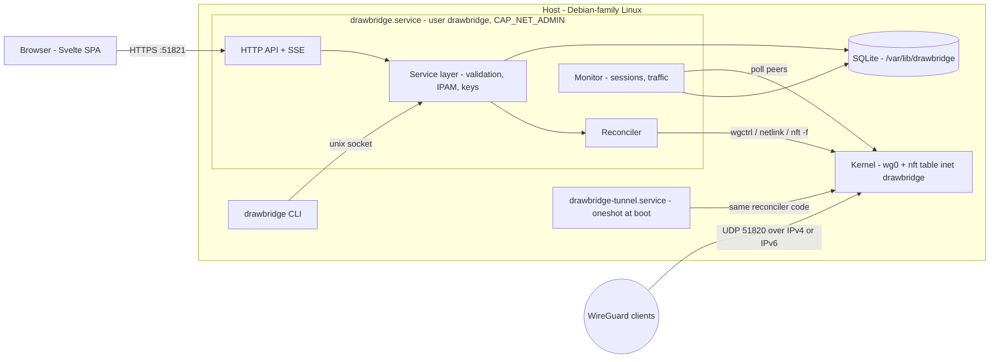
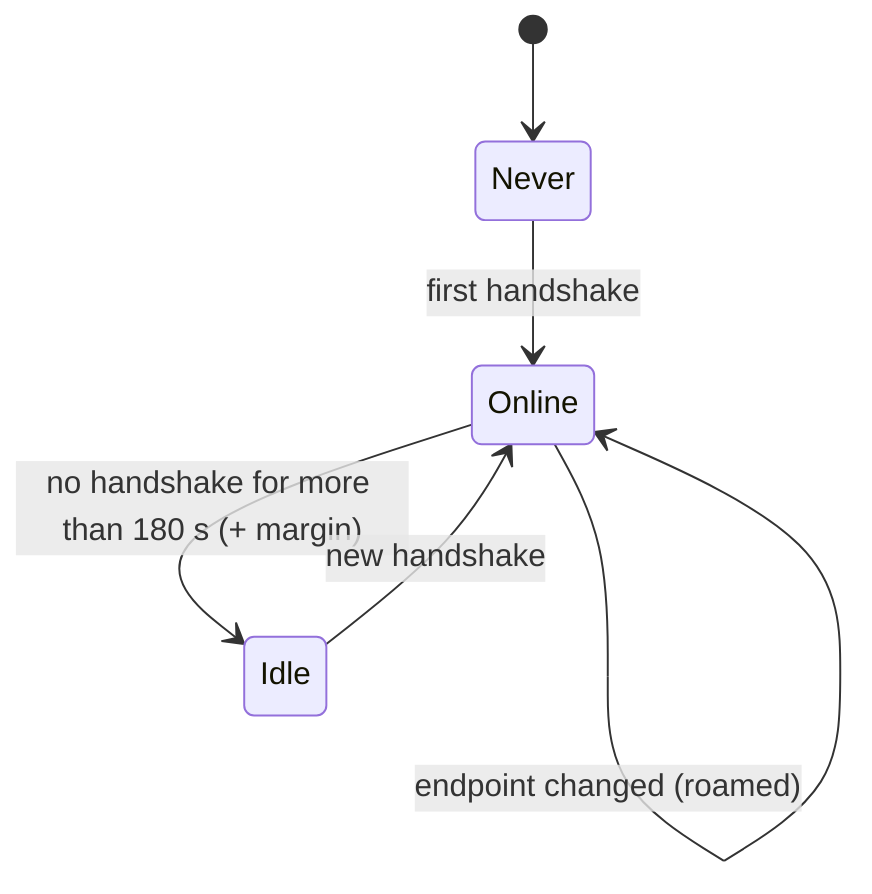

# Drawbridge: Project Plan

A self-hosted WireGuard VPN server with a web management GUI, installed natively (no Docker)
on Debian-family Linux with systemd, for arm64 and amd64. The reference platform, where it's
tested on real hardware, is a Raspberry Pi 5 running Debian 13 (trixie). The feature set is
modeled on [wg-easy](https://github.com/wg-easy/wg-easy), but the code is written from scratch.

The name: a drawbridge controls who crosses into the castle, and raising it (pausing a client)
keeps them out. "WireGuard" is a registered trademark, so it appears only in descriptions, never
in the product name.

> Status: **M0–M4 are built** (the tunnel, the CLI, the authenticated API, the web UI, and
> monitoring and logging, which ends with the AdGuard Home integration). The kernel tests pass in
> CI, and `docs/MANUAL_CHECKLIST.md` records what has run on real hardware.
> `drawbridge doctor`, the diagnostics page, `drawbridge backup create|restore`, the local
> snapshots, the backup download on the System page, outdated-config tracking, client key
> rotation, safe apply, and rotating the server's key, slices of M5, are built too.
> `docs/REQUIREMENTS.md` lists what the host and network need, and the known roadblocks.

---

## 1. Goals and non-goals

### Goals

- Run WireGuard on the **in-kernel** implementation on a Debian-family Linux host, managed by
  systemd, with no containers.
- Provide a **web GUI** that covers day-to-day management:
  - **Clients:** add, edit, remove, pause/resume, download the config, show a QR code, and view
    live status, connection history, and traffic.
  - **Server settings:** endpoint FQDN and port, interface addresses and subnets, MTU,
    keepalive, NAT and routing, and defaults for new clients.
  - **DNS settings:** resolvers pushed to clients (global and per client), and later an optional
    local resolver on the host.
  - **Logs:** connection events, traffic history, and an admin audit trail.
- **Dual stack.** Clients reach the server over IPv4 or IPv6 and tunnel both IPv4 and IPv6
  traffic.
- **Safe by default:** least-privilege processes, strong admin authentication, no arbitrary
  root command hooks, and an admin UI that isn't exposed to the internet by default.
- **Robust:** the VPN keeps running if the web UI crashes, is upgraded, or is stopped.
- **Easy to install and upgrade:** one `.deb` package that contains a single binary.

### Non-goals (for v1.0)

- Multi-server or clustered management.
- Replacing the host's general firewall. Drawbridge manages only its own nftables table.
- A userspace WireGuard implementation (`wireguard-go`). The kernel module is used.
- Native mobile apps. Clients use the official WireGuard apps.

---

## 2. Target platform and assumptions

`docs/REQUIREMENTS.md` is the user-facing version of this section, with workarounds for the
setups that need them.

| Item | Requirement |
|---|---|
| Hardware | Any arm64 or amd64 machine. WireGuard throughput isn't a bottleneck at typical home uplink speeds, even on a single-board computer. |
| OS | Debian-family Linux with systemd (the package is a `.deb`). |
| Kernel | The WireGuard module (`CONFIG_WIREGUARD`, mainline since 5.6) and nftables. Both ship with the Debian, Ubuntu, and Raspberry Pi kernels. |
| Userland packages | `nftables` (a dependency) and `wireguard-tools` (recommended, for debugging with `wg show`). |
| Network | A public IPv4 address with UDP 51820 forwarded to the host, or an IPv6 endpoint the router lets through; a DNS name that stays current (a dynamic DNS client if the public IPv4 address changes, since Drawbridge doesn't update DNS); for IPv6, a **stable** host address (not a temporary/privacy one). |
| Network stack | NetworkManager, systemd-networkd, or ifupdown. On ifupdown hosts the installer sets `accept_ra=2` on the uplink (§5.5). |
| Other services | Drawbridge uses only UDP 51820 and TCP 51821, so it coexists with a DNS resolver (port 53), web servers and reverse proxies (80, 443), and admin UIs like AdGuard Home's (3000). Using the host's own resolver as the clients' DNS needs it listening on the VPN addresses; setup checks (§6.3). |
| Uplink name | Not hard-coded (`eth0`, `end0`, `wlan0`, …). It's detected from the default routes. |
| Storage | microSD or SSD. Write volume is kept low by default to limit SD card wear, and configurable for SSDs (§6.4). |

**Reference platform.** Everything in `docs/MANUAL_CHECKLIST.md` marked verified ran on a
Raspberry Pi 5 (arm64) running Debian 13, with NetworkManager managing the network, AdGuard Home
on the host as the clients' resolver, and a consumer router that forwards UDP 51820 over IPv4
and lets it in over IPv6. The kernel integration tests also run on Ubuntu 24.04 (amd64) in CI.

---

## 3. Key decisions (summary)

| # | Decision | Recommendation | Why |
|---|---|---|---|
| D1 | Backend language | **Go** (decided) | A single static binary (arm64 or amd64) with no runtime needed on the host. It has first-class WireGuard and netlink libraries (`wgctrl`, `vishvananda/netlink`), uses little memory (about 20–40 MB), and cross-compiles easily. |
| D2 | Frontend | **Svelte 5 + SvelteKit (static adapter) + TypeScript + Tailwind** (decided) | Small bundles and little boilerplate. The build output is embedded in the Go binary with `go:embed`, so Node.js is needed only at build time. |
| D3 | Datastore | **SQLite** (`modernc.org/sqlite`, pure Go, WAL mode) | No database server and no CGO. One file, easy to back up. |
| D4 | Source of truth | **The database.** The kernel state is *derived* from it by a reconciler. | Changes are idempotent, restarts are safe, and drift is detected and corrected. |
| D5 | WireGuard control | **Netlink directly** (`wgctrl` + `netlink`), not `wg-quick` | Peer, port, key, address, and MTU changes apply live without restarting the interface, so other clients' sessions aren't dropped. It also avoids `wg-quick`'s root-run `PostUp` hooks (see §10). |
| D6 | Firewall and NAT | **nftables**, with a dedicated `table inet drawbridge` rendered to a file and applied with `nft -f` | The update is one atomic transaction and the ruleset is human-readable. It never touches the user's other rulesets. |
| D7 | Privileges | Runs as the unprivileged **`drawbridge` user with only `CAP_NET_ADMIN`**, with no root at runtime | Compromising the web app can't turn into arbitrary root code execution. |
| D8 | VPN vs UI lifecycle | **Two systemd units:** `drawbridge-tunnel.service` (oneshot, brings up the VPN at boot) and `drawbridge.service` (web UI and API daemon) | The VPN comes up at boot and keeps running even if the UI fails to start or is stopped. |
| D9 | Live updates in the UI | **Server-Sent Events (SSE)** | Simpler than WebSockets and sufficient for one-way status pushes. |
| D10 | Distribution | A **`.deb` built with nfpm** for arm64 (plus amd64 for VM testing), published as a GitHub Release | Installs and upgrades natively with `apt`/`dpkg`. |
| D11 | Admin UI exposure | **Home network and VPN only** (decided), enforced both in the app and in nftables. The admin may add extra private-range sources, such as a Tailscale tailnet, as a setting (2026-09-26) | Anyone who controls the UI can reach the whole home network, so it must never face the internet. Two independent layers keep it off the internet even if one is misconfigured. |
| D12 | Client DNS | **Public resolvers by default; a resolver on the host, such as AdGuard Home, when one answers on the VPN addresses** (decided; amended 2026-09-29); optional AdGuard Home integration syncs client names through its REST API (M4) | Ad-blocking and per-client DNS query logs for VPN clients, with no second resolver to run, on hosts that have one; a working default on hosts that don't. The setup wizard and Settings check the VPN addresses (`GET /api/server/dns-check`) and preselect the host only when it answers. |

---

## 4. Architecture

### 4.1 Components



All roles are subcommands of a single binary, `drawbridge`:

| Subcommand | Purpose |
|---|---|
| `drawbridge serve` | The long-running daemon: HTTP API, SSE, embedded SPA, reconciler, and monitor. |
| `drawbridge tunnel up\|down` | Used by `drawbridge-tunnel.service` to bring the VPN up or down from DB state (M1). |
| `drawbridge server show\|set\|rotate-key\|confirm\|revert` | Shows or changes the server's settings: endpoint, port, MTU, DNS, keepalive, client isolation (M1). `set --safe` undoes a change that could lock the admin out unless `confirm` keeps it in time; `revert` undoes it now. `rotate-key` gives the server a new key (M5). |
| `drawbridge client list\|add\|show\|pause\|resume\|rename\|delete\|config\|qr\|rotate-keys` | Headless client management. `qr` prints the QR code in the terminal (M1; `rename` M2; `rotate-keys` M5). |
| `drawbridge events [--client NAME]` | The event log: changes from the web and the CLI, logins, and corrected drift (M2). |
| `drawbridge apply [--dry-run]` | Reconciles once and prints the diff; `--dry-run` prints what it would change and changes nothing (M5). |
| `drawbridge admin create\|reset-password\|disable-2fa\|setup-token` | Recovery when locked out of the UI (M2; `disable-2fa` M5, built). |
| `drawbridge backup create\|restore` | `create` makes a passphrase-encrypted file with a consistent DB snapshot and the key, through the daemon. `restore` (root, daemon stopped) puts one back (§6.6, M5). |
| `drawbridge export --format wg-quick` | Prints an equivalent `wg-quick` config, for transparency or migrating away (M6). |
| `drawbridge import --from wg-quick\|wg-easy <file>` | Migration from an existing setup (M6). |
| `drawbridge doctor` | Host diagnostics in the terminal (see §6.6, M5). |
| `drawbridge tls show\|install\|reset` | Shows the web UI's certificate, serves the admin's own (`install --cert FILE --key FILE`) instead of the self-signed one, or goes back to it (§6.6, M5). |

The CLI talks to the daemon over `/run/drawbridge/control.sock` (mode 0660, owned by
`drawbridge:drawbridge`, in a 0750 directory), so root and members of the drawbridge group can
use it. The socket's peer credentials name the CLI user in the event log. In M2, the `admin`
commands go through the socket too. Making the recovery commands (`admin`, `backup`, `doctor`)
work with the daemon stopped, by opening the DB directly, is M5: `backup restore` does (it needs
root and a stopped daemon), and `backup create` still goes through the daemon.

### 4.2 Process and privilege model

`CAP_NET_ADMIN` is enough to create a WireGuard interface, configure its keys and peers over
generic netlink, set addresses, routes, and MTU over rtnetlink, and load nftables rules. Linux
passes ambient capabilities to exec'd binaries such as `nft`, so no process needs root at runtime.

Settings that need root are set once by the package's `postinst`:

- `/etc/sysctl.d/90-drawbridge.conf`: `net.ipv4.ip_forward=1` and `net.ipv6.conf.all.forwarding=1`
  (plus the `accept_ra` drop-in in §5.5, `/etc/sysctl.d/91-drawbridge-accept-ra.conf`).
- `/etc/modules-load.d/drawbridge.conf`: `wireguard`, so the module is loaded at boot.
- The `drawbridge` system user, the directories, the TLS certificate, and the at-rest
  encryption key.

`drawbridge.service` (abridged):

```ini
[Unit]
Description=Drawbridge WireGuard management daemon
Wants=network-online.target drawbridge-tunnel.service
After=network-online.target drawbridge-tunnel.service

[Service]
Type=notify
User=drawbridge
Group=drawbridge
ExecStart=/usr/bin/drawbridge serve --config /etc/drawbridge/drawbridge.toml
Restart=on-failure
AmbientCapabilities=CAP_NET_ADMIN
CapabilityBoundingSet=CAP_NET_ADMIN
NoNewPrivileges=yes
ProtectSystem=strict
ProtectHome=yes
PrivateTmp=yes
PrivateDevices=yes
ProtectKernelTunables=yes
ProtectKernelModules=yes
ProtectControlGroups=yes
RestrictAddressFamilies=AF_UNIX AF_INET AF_INET6 AF_NETLINK
RestrictNamespaces=yes
LockPersonality=yes
MemoryDenyWriteExecute=yes
SystemCallArchitectures=native
SystemCallFilter=@system-service
StateDirectory=drawbridge
RuntimeDirectory=drawbridge
UMask=0077

[Install]
WantedBy=multi-user.target
```

`drawbridge-tunnel.service` is `Type=oneshot` with `RemainAfterExit=yes`, the same user, the same
capabilities, and the same sandboxing. It runs `ExecStart=drawbridge tunnel up` and
`ExecStop=drawbridge tunnel down`, and is ordered `After=network-online.target nftables.service`.

The two units have separate lifecycles:

- `systemctl stop drawbridge` stops the UI only. The VPN keeps running.
- `systemctl stop drawbridge-tunnel` takes the VPN down.

### 4.3 Reconciler (desired state to kernel state)

Every change follows the same path:
**validate → write the DB (transaction) → reconcile → emit an event**.

The reconciler is idempotent. It is serialized by a lock and runs in four situations: on
startup, after every change, every 30 s to detect drift, and from `drawbridge tunnel up`.

1. **Validate** the desired state:
   - No overlapping or duplicate addresses or keys.
   - The VPN subnets don't overlap any subnet on the host's interfaces.
   - MTU ≥ 1280 when IPv6 is enabled.
2. **Interface:**
   - Create `wg0` over netlink if it's missing. Only `drawbridge tunnel up` does this. The
     daemon's runs leave a missing interface alone, so a tunnel the admin stopped stays
     stopped (ADR 0008).
   - Set the private key and listen port.
   - Add or remove addresses to match the desired state.
   - Set the MTU and bring the link up.
3. **Peers:** diff the kernel peers against the enabled clients in the DB.
   - Add new peers and remove stale ones.
   - Update changed peers with `ReplaceAllowedIPs`. This doesn't interrupt their sessions.
4. **Routes:** add a route through `wg0` for each extra subnet routed to a client (site-to-site).
5. **Firewall:** render `table inet drawbridge` and apply it atomically with `nft -f`
   (`table …; delete table …; table … { … }` in a single transaction).
6. **Record** the applied revision. If step 1 corrected drift (for example, after someone ran
   `wg set` by hand, or `nftables.service` ran `flush ruleset`), log a warning event.

**Safe apply (commit-confirm; built 2026-10-04).** Some changes can cut off an admin who is
connected through the VPN: listen port, subnets, the server's key, and firewall or NAT changes. The
UI warns first. After it applies the change, the admin has 60 s to click "Keep changes". If they
don't (for example, because the change disconnected them), the previous settings are restored
automatically.

- **What waits.** `needsConfirmation` (`internal/service/safeapply.go`) lists it, and today it's
  a change to the listen port and the removal of a source from the admin UI's allowlist (which
  can be the one the admin is on). The endpoint, DNS, keepalive, MTU, client isolation, and adding
  a source can't lock anyone out, so they apply as before. Rotating the server's key is on the
  list too (§6.2), and changing the subnets will join it when it exists.
- **Who waits.** Every change from the web UI. The CLI applies at once, because the person at the
  host can't be cut off by it, unless it's told to (`server set --safe`): an admin on SSH over the
  VPN can ask for the same protection.
- **The mechanics.** The change and the settings it replaced are written in one transaction
  (`pending_apply`, schema 10; `store.UpdateSettingsWith`), with the server's key sealed apart so
  it's never stored unencrypted. The deadline is in the database, not in the daemon's memory, so a
  restart or a reboot inside the window still undoes the change: the daemon looks when it starts
  and then every second (`Service.RunSafeApply`), and `drawbridge-tunnel.service`, which applies
  whatever the database says at boot, is corrected by the daemon right after. Undoing writes the
  old settings back and reconciles.
- **Keeping and undoing.** `POST /api/server/apply/confirm` keeps it, and `.../revert` undoes it
  at once; `drawbridge server confirm|revert` do the same. A keep that arrives at or after the
  deadline doesn't count: the change is undone and the answer is 409, so there's no race with the
  daemon's next look.
- **One at a time.** While a change waits, every other settings change is refused (409, "keep it
  or undo it first"), because undoing restores a snapshot of the whole settings and would take a
  change made meanwhile with it. Clients can still be added, paused, and so on.
- **What the window can't do.** The daemon can't tell whether the admin got cut off: a click on Keep
  from a browser that can still reach the UI is the proof. It also leaves the other consequences
  of the change alone: a new listen port still means every client needs its new config.
- **Events:** `server.settings_changed` (with `waiting_to_be_kept` and the window),
  `server.settings_kept` and `server.settings_undone` (the admin's), and `server.settings_expired`
  (a system event: the daemon undid it because nobody kept it, with the reason).
- **The web UI** shows the change on every page in a bar with a countdown, **Keep changes**, and
  **Undo now**. It gets the change from the live feed (`pending_change` in the stream's status, and
  not in `ServerStatus`, which a read-only token can read), or by asking `GET /api/server/apply`
  every few seconds when the feed can't be had. The countdown starts from `expires_in`, the seconds
  left when the server sent it, so a browser whose clock is wrong still counts correctly.
- **The window** is 60 s (`--safe-apply-window`, at least 1 s).
- **`drawbridge apply [--dry-run]`** reconciles once and lists what it changed; `--dry-run` lists
  what it would (`Reconciler.Plan` runs the same steps against a backend that changes nothing). It
  never starts a tunnel that is stopped (ADR 0008).

### 4.4 Filesystem layout

| Path | Owner / mode | Contents |
|---|---|---|
| `/usr/bin/drawbridge` | root 0755 | Single binary with the SPA embedded |
| `/etc/drawbridge/drawbridge.toml` | root:drawbridge 0640 | Bootstrap config: listen addresses, allowed admin source ranges, TLS paths, log level, DB path |
| `/etc/drawbridge/secret.key` | root:drawbridge 0640 | 32-byte key for encrypting private keys at rest |
| `/var/lib/drawbridge/drawbridge.db` | drawbridge 0600 | SQLite DB (WAL) |
| `/var/lib/drawbridge/nftables.conf` | drawbridge 0600 | Last rendered ruleset, kept for inspection |
| `/var/lib/drawbridge/tls/` | drawbridge 0700 | Self-signed or uploaded or ACME certificates |
| `/var/lib/drawbridge/backups/` | drawbridge 0700 | Nightly rotating DB snapshots |
| `/run/drawbridge/control.sock` | root:drawbridge 0660 | CLI control socket |

---

## 5. Networking design

### 5.1 Addressing and IPAM

| Setting | Default | Notes |
|---|---|---|
| IPv4 subnet | `10.8.0.0/24`, server `10.8.0.1` | Any RFC 1918 CIDR from /16 to /29. Checked for overlap with LAN subnets. |
| IPv6 subnet | Random **ULA /64** generated at install per RFC 4193 (e.g., `fd3a:5c1e:92b0:1::/64`), server `::1` | A random prefix avoids collisions with other ULA networks. |
| Client addresses | Next free host in each family, e.g., `10.8.0.23/32` + `fd3a:5c1e:92b0:1::23/128` | The IPv6 host ID mirrors the IPv4 host index so the two addresses are easy to match up. Both are editable. |
| Listen port | UDP `51820` | The kernel socket listens on both IPv4 and IPv6. |

Changing a subnet re-addresses every client and keeps host IDs where possible. It goes through
safe apply, and every client config is then flagged as outdated (§6.1).

### 5.2 IPv6 modes

1. **NAT66 (default).** Clients get ULA addresses, and traffic to the internet is masqueraded
   behind the host's global IPv6 address. It works with any ISP and router and needs no router
   changes.
   - Per RFC 6724, many operating systems prefer IPv4 over a ULA source for dual-stack
     destinations. IPv6-only destinations still work. This is expected behavior, not a bug.
2. **Routed GUA (advanced, M6).** Clients get global addresses, so there's no NAT and they get
   native IPv6. It depends on a stable prefix from the ISP. There are two ways to do
   it:
   - **Routed /64:** the router routes a separate /64 from the ISP's delegated prefix to the host.
     This needs the ISP to delegate more than a /64 (for example, a /56) and the router to accept
     an **IPv6** static route. Many consumer routers accept IPv4 static routes only (§16).
   - **NDP proxy:** clients get addresses from a reserved slice of the LAN's own /64, and the host
     answers neighbor discovery for them (`proxy_ndp` sysctl plus proxy entries managed by the
     reconciler). It needs no router support, so it's the fallback when the router can't route
     IPv6.
3. **IPv6 disabled.** Clients still get `::/0` in `AllowedIPs` (optional, on by default). IPv6
   traffic is then dropped inside the tunnel instead of leaking outside it.

### 5.3 Firewall and NAT (nftables)

Drawbridge owns only `table inet drawbridge`. A rendered example (the LAN prefixes are
examples; the real ones are detected from the uplink interface):

```nft
# Generated by Drawbridge. Do not edit; changes are overwritten.
table inet drawbridge {
  set admin_allowed4 {                              # LAN + VPN (§6.5)
    type ipv4_addr; flags interval
    elements = { 192.168.4.0/22, 10.8.0.0/24 }
  }
  set admin_allowed6 {                              # link-local + LAN /64 + VPN
    type ipv6_addr; flags interval
    elements = { fe80::/10, 2001:db8:1234:5600::/64, fd3a:5c1e:92b0:1::/64 }
  }
  chain input {
    type filter hook input priority filter; policy accept;
    iif "lo" accept
    tcp dport 51821 ip  saddr != @admin_allowed4 drop   # admin UI: never from the internet
    tcp dport 51821 ip6 saddr != @admin_allowed6 drop
  }
  chain forward {
    type filter hook forward priority filter; policy accept;
    iifname "wg0" oifname "wg0" drop                  # client isolation (toggle)
    # per-client policies, e.g., "internet only" (M6):
    # iifname "wg0" ip saddr @internet_only4 ip daddr @private4 drop
  }
  chain mss_clamp {
    type filter hook forward priority mangle; policy accept;
    oifname "wg0" tcp flags syn tcp option maxseg size set rt mtu
    iifname "wg0" tcp flags syn tcp option maxseg size set rt mtu
  }
  chain postrouting {
    type nat hook postrouting priority srcnat; policy accept;
    ip saddr 10.8.0.0/24 oifname != "wg0" masquerade
    ip6 saddr fd3a:5c1e:92b0:1::/64 oifname != "wg0" masquerade   # NAT66 mode
  }
}
```

NAT masquerades the VPN subnets on every interface except the tunnel. That covers whichever
interface is the uplink (Ethernet or Wi-Fi) without detecting it, and the home LAN too, whose
devices have no route back to the VPN subnets.

The admin sets hold the LAN's subnets as detected at each reconcile (every 30 s), so a new
IPv6 prefix from the router is admitted within half a minute, and the always-allowed loopback and
link-local ranges. `tunnel down` deletes the whole table, admin chain included; while the tunnel
is stopped, the app's own allowlist is the only layer (§6.5).

In nftables, an `accept` in one table can't override a `drop` in another. For that reason,
Drawbridge adds only **restrictive rules and NAT**. It never tries to "open" the host firewall.
Because a `drop` in any table is final, the `input` chain above enforces the admin UI allowlist
no matter how the host firewall or the router's IPv6 firewall is set up. For the opposite case, the
diagnostics page (§6.6) detects configurations that block VPN traffic and explains how to fix
them:

- A `policy drop` in the user's own `forward` or `input` chains.
- Docker's iptables `FORWARD` policy `DROP`, which silently breaks VPN forwarding when a
  *rootful* Docker daemon runs on the same host. Rootless Docker keeps its rules in its own
  network namespace and doesn't touch the host firewall, so it isn't affected.

Debian's default `/etc/nftables.conf` begins with `flush ruleset`, so restarting
`nftables.service` wipes the Drawbridge table. The 30-second drift check restores it.

A **routed IPv4 mode** (no NAT, M6) is also available. It needs a static route to `10.8.0.0/24`
via the host's LAN address on the home router, which most routers support. LAN devices then see
real client addresses instead of the host's. NAT stays the default because it needs no router
changes.

### 5.4 MTU

- The server MTU defaults to **1420**, which fits a 1500-byte path over either family:
  - IPv4 outer header: 1500 − 20 (IPv4) − 8 (UDP) − 32 (WireGuard) = 1440.
  - IPv6 outer header: 1500 − 40 (IPv6) − 8 (UDP) − 32 (WireGuard) = 1420.
- Client MTU defaults to the server value and can be overridden per client. For example, use
  **1412** or lower over PPPoE, and lower values for some mobile carriers.
- Validation enforces 1280 ≤ MTU ≤ 1500 when IPv6 is enabled. IPv6 requires at least 1280.
- MSS clamping (§5.3) protects TCP when path MTU discovery is broken.

### 5.5 Host prerequisites (handled by the installer and verified by `doctor`)

- **Forwarding sysctls** for IPv4 and IPv6.
- **Router Advertisements.** Enabling IPv6 forwarding makes the kernel **ignore RAs** on
  interfaces where `accept_ra=1`. A host that relies on kernel SLAAC (ifupdown) would lose its
  own IPv6 address and default route.
  - NetworkManager and systemd-networkd handle RAs in userspace and set `accept_ra=0`, so
    they aren't affected.
  - The installer runs `/usr/lib/drawbridge/accept-ra` before it enables forwarding. For each
    uplink (the default route's interface, IPv6 first, then IPv4 for an upgrade where the IPv6
    route is already gone) whose `accept_ra` is `1`, it sets `accept_ra=2` now and writes
    `/etc/sysctl.d/91-drawbridge-accept-ra.conf` for boot. An upgrade keeps an interface
    already in that file while it still reads `2`. `postrm` removes the file. The kernel
    integration tests send a Router Advertisement to a namespace with forwarding on: the host
    ignores it before the step and configures its address and default route after.
- **NetworkManager and `wg0`:** when NetworkManager is active, the installer adds
  `/etc/NetworkManager/conf.d/drawbridge.conf` with `[keyfile]`
  `unmanaged-devices=interface-name:wg0`, so NetworkManager never tries to configure the VPN
  interface or remove its addresses.
- **Kernel module:** `wireguard` is loaded at boot.
- **Time sync:** `systemd-timesyncd` is active. Hosts without a battery-backed clock (such as a
  Raspberry Pi without its RTC battery) start with the wrong time, and TLS, TOTP, and handshake
  timestamps depend on the correct time.
- **Uplink detection:** the default route for each address family, with an optional manual
  override in the UI.

### 5.6 Endpoint and FQDN

- Clients use `Endpoint = <FQDN>:<port>`. The FQDN should have an **A** record and an **AAAA**
  record (for the host's stable IPv6 address).
- A per-client **endpoint override** lets a client use, for example, an IPv4-only hostname
  (`vpn4.example.com`) when it's on a network with broken IPv6.
- **Dynamic IPv4 address:** a dynamic DNS client the admin already runs (ddclient, or the
  router's built-in one) keeps the A record current, so Drawbridge doesn't include its own DDNS
  updater. Diagnostics compare the A record with the current public IPv4 address (looked up only
  when the check runs) and warn when they differ.
- **AAAA record:** with a stable IPv6 prefix, the simplest setup is a static AAAA record
  pointing at the host's stable address. If a dynamic DNS client updates AAAA too, it must use
  the host's *stable* address. An external "what's my IP" lookup returns the temporary (privacy)
  address that the host uses for outgoing connections, and that address changes every day or so.
  Diagnostics warn if the AAAA record points at a temporary address. `ip -6 addr show scope global
  -temporary` lists the stable addresses.
- WireGuard clients resolve the endpoint once, when they connect. After the public IPv4 address
  changes, clients need to reconnect (phones usually do this on their own when they switch
  networks).
- **CGNAT or DS-Lite** (no inbound IPv4) can't be fixed on the host. The docs explain two
  options: an IPv6-only endpoint, or a relay VPS.

---

## 6. Feature specification

### 6.1 Clients

| Feature | Behavior |
|---|---|
| **Add** | Fields: name (required, unique) and notes. IPv4 and IPv6 addresses are auto-assigned (editable). A server-side keypair and a preshared key (PSK) are generated by default. **Bring-your-own-key** mode instead takes the client's public key, so the private key never touches the server. |
| **Access presets** | Client `AllowedIPs` presets: *Full tunnel* (`0.0.0.0/0, ::/0`), *VPN subnet only*, *VPN + home LAN* (LAN prefixes auto-detected), or *Custom*. |
| **Advanced per client** | Overrides for DNS, MTU, PersistentKeepalive (default 25 s), and endpoint. Server-side extra routed subnets for site-to-site. Expiry date. |
| **Pause / resume** | Pausing sets `enabled=false` and **removes the peer from the kernel** while keeping all config in the DB, so the client can't handshake at all. Resuming re-adds the peer. Clients can also be paused until a set date and time (M6). |
| **Remove** | Deletes the peer and the DB row after confirmation. Past events keep a snapshot of the client name, so the logs stay readable. |
| **Config delivery** | Download a `.conf` file or show a QR code (generated in the browser; the view is logged). One-time download links that expire (M6). |
| **Outdated-config tracking** | Stores the fingerprint of the config the client last received. When server-side changes (endpoint, port, server key, DNS, and so on) alter the rendered config, the client is flagged **"config outdated, re-import needed"**. *Built (2026-10-04); details below.* |
| **Key rotation** | Regenerates the client keypair and PSK, and flags the config as outdated. *Built for clients (2026-10-04): `POST /api/clients/{id}/rotate-keys`, `drawbridge client rotate-keys`, and a button on the client's page. Rotating the server's key is built too, and goes through safe apply (§6.2).* |

**How outdated-config tracking works (built 2026-10-04).**

- A client's config is "received" when the admin hands it out: downloaded, shown as a QR code in
  the web UI, or printed by `client config` or `client qr`. Every one of those goes through
  `Service.Config`, which stores the config's fingerprint and the time on the client
  (`delivered_hash`, `delivered_at`) and records the `client.config_viewed` event.
- The **fingerprint** (`clientconf.Fingerprint`) is the SHA-256 of the rendered config with the
  client's *public* key where its private key goes, and "a preshared key is present" where the
  preshared key goes. No secret is in it, so it's stored unsealed, and it can be computed for a
  client whose private key the server doesn't keep. A preshared key can't change without the
  client's keys, and rotating them changes the public key.
- A client is **outdated** when it has a stored fingerprint and the fingerprint of the config the
  server would render now differs from it. It's a comparison, not a count of changes: undoing a
  change before the client imports anything leaves it current. It's computed on each read (the
  list, one client, and the live stream), never stored, so nothing writes to the database on a
  poll. The responses to a change leave it out.
- A client whose config was never handed out isn't outdated: there's nothing for it to be out of
  date with. So is one whose config can't be rendered now (no endpoint is set).
- **Upgrading from a release without tracking:** existing clients have no stored fingerprint, so
  none is flagged by the upgrade. Each gets its baseline the next time its config is viewed.
- Changing how a config is rendered changes every fingerprint, which flags every client that was
  handed one the moment the server is upgraded. `TestFingerprintIsTheHashOfAKnownText` pins the
  rendering, so that is a decision someone has to make out loud.
- The dashboard counts the outdated clients (a tile that opens the client list filtered to them);
  the list and a client's page badge them, and the page says what to do. In the CLI, `client list`
  has a CONFIG column and `client show` a Config row.
- **Key rotation** replaces the client's key pair and preshared key in one transaction, then
  reconciles: the old peer leaves the kernel and the new one joins, so the client is cut off at
  once and the connection tracker closes its session. The stored fingerprint stays, so the client
  reads as outdated until the admin hands out the new config. The
  web UI asks first, and shows the new QR code afterward. The event is `client.keys_rotated`, with
  the new public key and no secret. A client whose private key the server doesn't keep can't be
  rotated (409): only the client could make a key pair.
| **Live status** | Online, idle, or never connected; last handshake; current endpoint (IP:port); RX/TX totals; live throughput. |

Example generated client config:

```ini
[Interface]
PrivateKey = <client private key>
Address = 10.8.0.23/32, fd3a:5c1e:92b0:1::23/128
DNS = 1.1.1.1, 2606:4700:4700::1111
MTU = 1420

[Peer]
PublicKey = <server public key>
PresharedKey = <psk>
Endpoint = vpn.example.com:51820
AllowedIPs = 0.0.0.0/0, ::/0
PersistentKeepalive = 25
```

### 6.2 Server settings

The settings are grouped into sections. Each field shows its impact ("applies live",
"disconnects clients", or "client configs must be re-imported"), and risky changes go through
safe apply (§4.3).

- **Endpoint:** public FQDN or IP and the advertised port (which can differ from the listen port
  when the router uses port translation). An optional "detect public IP" button calls an external
  service only when clicked.
- **Interface:** interface name, listen port, MTU, and rotating the server keypair (with a strong
  warning, because every client must re-import its config). *Rotating the key is built
  (2026-10-04); see "Rotating the server's key" below.*
- **Addressing:** IPv4 CIDR and server address; IPv6 on or off, its CIDR and server address, and
  the mode (NAT66 or routed).
- **Routing and firewall:** uplink interface (auto or manual), NAT on or off for each family,
  client isolation, and MSS clamping.
- **Defaults for new clients:** DNS, AllowedIPs preset, MTU, keepalive, PSK on or off, and
  whether client private keys are stored on the server.

**Rotating the server's key (built 2026-10-04).** Every client's config holds the server's public
key, so a new key pair cuts every client off until it imports the new config. It's the answer to
a server key that may have leaked, and it's never worth doing for tidiness.

- **How.** `POST /api/server/rotate-key`, the **Rotate the key…** button in Settings (which asks
  first), and `drawbridge server rotate-key [--safe] [--yes]`. The new private key is generated
  and saved by the same transaction path as any settings change (`Service.RotateServerKey`), then
  the reconciler sets it on the live interface. The peers aren't touched. The event is
  `server.key_rotated`, with `server_public_key: old → new` (public keys only).
- **It waits to be kept.** The web UI always asks for safe apply, and the key is on
  `needsConfirmation`'s list (§4.3): an admin connected through the VPN is cut off by it, and
  can't confirm. Undoing restores the old key from the sealed copy in `pending_apply`, and the
  clients' configs are current again (the flag is computed, §6.1). The CLI rotates at once unless
  it's given `--safe`, and asks `[y/N]` first unless it's given `--yes`.
- **What it does to clients.** WireGuard drops every current session when the interface's private
  key changes, so a connected client stops at once, and its next handshake fails because it still
  names the old public key (observed on a 7.0 kernel, and a step of `TestEndToEnd`). Each client
  that had been handed a config shows as outdated, the dashboard counts them, and the CLI says how
  many. Clients that were never handed a config aren't flagged: they have nothing stale.
- **What it can't do.** It doesn't hand the new configs out: that's one QR code or download per
  device, and the admin does it. The old key isn't kept anywhere except in the pending row while
  the rotation waits, and a backup made before the rotation holds the old key.

### 6.3 DNS

Drawbridge doesn't install or manage a resolver. When the host already runs one on all
addresses (AdGuard Home, Pi-hole, Unbound, dnsmasq), it becomes the clients' resolver, and
AdGuard Home in particular gets an optional integration (below).

- **Default for new clients:** Cloudflare's public resolvers (`1.1.1.1` and `1.0.0.1`, plus the
  IPv6 pair when the VPN has IPv6), because they work on any host. *This server* (the server's VPN
  addresses, `10.8.0.1` and `fd…::1`) is a choice the admin makes, and only after the server has
  checked that something answers DNS there. The other choices are *Other servers* and *None*.
  Each preset has IPv4 and IPv6 addresses.
  - **The check** (`GET /api/server/dns-check`): the daemon sends a UDP DNS query for
    `example.com` (an A record, recursion desired) to each VPN address on port 53, in parallel,
    and waits two seconds. NOERROR and NXDOMAIN count as an answer. REFUSED and SERVFAIL mean a
    resolver is listening but unusable (its access settings may exclude the VPN, or its upstream
    servers are down); a refused connection means nothing is listening; silence means a firewall
    or a stopped tunnel. Each address is reported on its own, and "this server" saves only the
    ones that answered, so a resolver bound to IPv4 alone doesn't leave clients waiting on an IPv6
    address that never replies. systemd-resolved's stub listens on `127.0.0.53` only, so the
    check finds nothing there.
  - **The CLI** (`drawbridge server set --dns server`) runs the same check through the control
    socket (`GET /v1/dns-check`) and saves only the addresses that answer. When none does, it
    refuses and says why; `--force` saves both VPN addresses anyway.
  - **The setup wizard** (§9) runs the check on its DNS step and preselects *This server* when it
    finds an address that answers; otherwise it preselects the public resolvers. Settings has the
    same choices and a check button.
- Optional **search domains** (written to the `DNS =` line; `wg-quick` supports them, and support
  varies across the client apps).
- **Per-client override.**
- **AdGuard Home requirements** (checked by diagnostics, with fix hints):
  - It must answer DNS on both VPN addresses. If its `dns.bind_hosts` setting lists specific
    addresses rather than all interfaces, the VPN addresses must be added, and AdGuard Home must
    start after `drawbridge-tunnel.service` so those addresses exist. When it listens on all
    addresses (its default), the VPN addresses are covered with no changes.
  - Its access settings must allow the VPN subnets. The default allows all clients.
  - There are no port clashes: AdGuard Home uses port 53 and its own web port, while Drawbridge
    uses UDP 51820 and TCP 51821.
- **AdGuard Home integration (optional)** through its REST API (under `/control`, with HTTP
  basic auth; for a local install, `http://127.0.0.1:3000/control` by default). It uses a
  dedicated AdGuard Home account whose password Drawbridge stores encrypted. Without AdGuard
  Home, everything else works the same.
  - **Client name sync (M4):** each Drawbridge client becomes an AdGuard Home persistent client
    with its VPN IPv4 and IPv6 addresses (`/control/clients/add`, `/update`, `/delete`). AdGuard
    Home's query log and statistics then show names like `phone` instead of `10.8.0.23`.
  - **Per-client DNS log (M4):** the client detail page shows the client's recent DNS queries
    from AdGuard Home's query log (`/control/querylog?search=<client IP>`), with a link to
    AdGuard Home.
  - **Per-client ad-blocking switch (M6):** turns AdGuard Home filtering off or on for one client,
    for example a device that breaks when ads are blocked.
  - **Client hostnames (M6):** AdGuard Home DNS rewrites (`/control/rewrite/*`) give clients names
    such as `<client>.vpn.lan`.
  - If AdGuard Home is unreachable, VPN management keeps working. Sync retries in the background,
    and the dashboard shows a warning.
  - **What AdGuard Home does** (checked against v0.107.79 on 2026-10-03, and written into the
    client, `internal/adguard`, and its fake; the OpenAPI document says none of this):
    - Every refusal is a plain-text 400, never a 404 or a 409, so the sync decides from a fresh
      listing and never reads a message.
    - **A client added with only a name and addresses isn't ad-blocked.** It's stored with
      "use global settings" off, and its own filtering with it, so a query for a blocked domain
      from its address is answered by the upstream resolver. Sync adds clients with the global
      settings on.
    - **An update replaces the whole client.** A rename that sends only the name and addresses
      wipes the tags, upstreams, and settings the admin set in AdGuard Home. Sync reads the client
      back and changes only the name and the addresses.
    - **Five failed logins block the caller for 15 minutes**, and then even the right password
      gets a bare 401. A 401 stops the sync, and it isn't retried on a timer: the admin changes
      the settings or presses Test, which is one attempt.
    - The query log's search is a **substring** match, so 10.8.0.2 also finds 10.8.0.20. The
      DNS log keeps only entries from exactly the client's addresses, and pages past its busy
      neighbors.
  - **The connection (built).** Settings has the address, the account's username, and its
    password, with a Test button, a Save, and a Remove. The password is encrypted in the database
    and can be set but never read back. **It's sent only to the address and account it was saved
    with**: a request that changes either (a save, or a test of unsaved values) has to bring the
    password again, or it's refused before anything is sent. Otherwise anyone who could save an
    address, a hijacked session say, could point it at their own server and have the daemon send
    them the saved password. The test reports AdGuard Home's version, whether its DNS server runs
    and its protection is on, how its query log is set (off, or hiding client addresses, which
    would leave a client's DNS log empty), and what the server's VPN addresses answer for DNS. A
    refused account is remembered for 30 seconds, so a double click can't walk the daemon into
    AdGuard Home's 15-minute block. Saving and removing are events; neither carries the password.
  - **How name sync works (built).** Two switches in Settings: *Use AdGuard Home*, and under it
    *Name clients in AdGuard Home*. Like the reconciler, it's level-triggered: it lists AdGuard
    Home's persistent clients, compares them with Drawbridge's, and makes up the difference
    (`internal/service/adguardsync.go`). It runs at startup, a second after a client is added,
    renamed, or deleted or the connection changes, and every five minutes, so an AdGuard Home that
    was down, or a name the admin deleted there, catches up. *Sync now* runs a pass at once.
    - **Drawbridge changes only the clients it made**, which are the ones it has a record of
      (§7), and a client whose name and addresses are exactly a Drawbridge client's, which it
      adopts without a write (a restored database, say). It never edits or deletes any other
      persistent client. A client of the admin's that has the name or an address a Drawbridge
      client wants is a *conflict*: shown in Settings and on the dashboard, once in the event log,
      and settled by the admin in AdGuard Home. The next pass notices.
    - **A client is added with AdGuard Home's global settings on**, or it isn't ad-blocked. A
      rename or an address change reads the client back and changes only the name and the
      addresses, so the admin's tags, upstreams, settings, and added identifiers (a MAC address)
      stay.
    - **The admin's changes are repaired**: a name deleted in AdGuard Home comes back, and one
      renamed there goes back, but only while it still has exactly the addresses Drawbridge gave
      it. With others added too, it may be the admin's, and it's left alone.
    - **A deleted client's name is deleted** from AdGuard Home, but only if the client of that name
      still has an address Drawbridge gave it. One the admin has made into something else stays.
    - Paused clients are synced too, because they keep their addresses.
    - **A refused account (401) stops the sync**, and nothing is asked until the connection
      changes, or Test connection or Sync now shows the account works (at most one try in 30
      seconds), because five refusals block the daemon for 15 minutes. Any other failure retries
      after 30 seconds, doubling to 5 minutes. A first failure is one event
      (`integration.adguard_sync_failed`, a warning in the journal), and so is the recovery.
    - What it does to AdGuard Home is events: `integration.adguard_name_added`, `…_renamed`, and
      `…_removed`, and `…_name_failed` for a conflict. They're system events, attributed to the
      admin when *Sync now* started the pass.
    - Its status (the last sync, the error, the conflicts) is kept in memory, and a sync that
      changes nothing writes nothing, because of the SD card (§6.4). The dashboard shows a
      warning from it (`adguard_warning` in `GET /api/server/status` and the stream) while it
      can't reach AdGuard Home, was refused, or has conflicts.
    - Removing the connection forgets the record. What it wrote stays in AdGuard Home, because the
      account to remove it with is gone. Another address starts the record over, because it's
      another AdGuard Home.
  - **Per-client DNS log (built)** is a section on the client's page, "Recent DNS Queries": the
    latest 50 queries (up to 200 with `limit`) newest first: when, the name and type, what it
    answered, and, when AdGuard Home blocked it, the rule. It reads when the page opens and when
    asked again, not on a timer. It needs *Use AdGuard Home* on, and not name sync: reading
    writes nothing. Viewing it isn't an event, because it changes nothing, and AdGuard Home's own
    interface shows the same.
    - AdGuard Home's search matches part of an address (verified), so the daemon asks for each of
      the client's addresses, keeps only the entries from exactly that address, and looks
      through at most five pages of 200 for each, so a client that's been quiet behind busy
      neighbors can show fewer than asked for. The queries are fetched on the page's request, not
      kept.
    - It says so when AdGuard Home's settings leave the view empty: its query log is off, or it
      hides the end of each client's address (verified: it logs every client as `10.8.0.0`). A
      client that has simply looked nothing up gets no warning.
    - It follows the sync's rule for a refused account: after one 401 it asks no more, whoever
      asked, until the connection changes or a test shows the account works. A page that's
      reloaded can't walk the daemon into AdGuard Home's block.
    - "Open this client's queries in AdGuard Home" links to AdGuard Home's own log, searching
      for the client's IPv4 address. The saved address is the daemon's, and for a local install
      it's `127.0.0.1`, which only the host can open, so the link uses the host the admin is
      browsing Drawbridge on, with AdGuard Home's port.
  - **Other resolvers.** AdGuard Home is the first integration, not the only one the design
    allows. Pi-hole is the likeliest next (its v6 API only). Without an integration, a host's
    resolver of any kind still works as the clients' DNS: the check, the wizard, and `doctor`
    only send it a query. The integration is a seam, kept thin on purpose:
    - Only one resolver can answer on the VPN addresses, so one integration is active at a time,
      and it's stored as a single row with a `kind` (§7).
    - The sync (names to make up, a record of what Drawbridge wrote, conflicts, status) and the DNS
      log's shape (when, name, type, answer, blocked, rule) don't mention AdGuard Home. Its
      client, `internal/adguard`, holds everything that does: its calls, its login, and the
      behavior above.
    - The sync's interface is drawn from AdGuard Home's calls alone for now. A second provider
      will show what is shared, and the interface changes then rather than before. Pi-hole differs
      in ways worth checking on a live instance first: its login is a session (`POST /api/auth`,
      a session ID that lapses after 300 s of disuse, a limit on concurrent sessions, a rate
      limit, and an optional TOTP), with no username, and it has no named persistent client, so
      naming a client is likely a local DNS record, which also makes the name resolvable (what
      the M6 client hostnames do for AdGuard Home).
- **Health check:** if clients are pointed at the host but nothing answers on port 53 at the VPN
  addresses, the UI shows a warning.

### 6.4 Monitoring and logging

WireGuard is connectionless and logs nothing itself, so Drawbridge derives activity from peer state.
The monitor polls `wgctrl` every 5 s, which costs very little.

*Built ahead of the rest of M4 (2026-09-27): the poller (`Service.TrackConnections`,
`internal/service/conntrack.go`), the `connected`/`disconnected`/`roamed` events below, and the
`client_sessions` table, scoped to the bytes a client's current connection has moved (the API's
`session_receive_bytes`/`session_send_bytes`, alongside the peer's all-time totals). The traffic
table, sampler, and rollup/retention job are also built (2026-09-28:
`internal/service/traffic.go`, `internal/store/traffic.go`), along with the API routes that read
both it and a client's session history (§8: `GET /api/clients/{id}/traffic`, `GET /api/traffic`,
`GET /api/clients/{id}/sessions`). The dashboard's bandwidth chart, the client-detail
page's bandwidth and cumulative charts, and its session-history list are built too (uPlot, per
§9). Every chart has the same range control (1m/1h/12h/24h/7d/30d/90d), and the choice is one for
the whole app, remembered in the browser. A Charts page (an icon in the header, between Clients
and Server Settings) shows the same history per client, as Received, Sent, Cumulative Received,
and Cumulative Sent charts, stacked (`GET /api/traffic/clients`). The log viewer's filters and CSV
export are built too (below), and so are the structured journald fields. AdGuard Home client
name sync and the per-client DNS log are built (§6.3).*



- **Events** (one table, filterable by client, type, and date, exportable as CSV):
  - Connection events: `connected`, `disconnected` (with session duration and bytes), and
    `roamed` (with the new endpoint IP).
  - Admin events: `created`, `updated`, `paused`, `resumed`, `deleted`, `config_downloaded`,
    `qr_shown`, and `keys_rotated`.
  - System events: `apply_ok`, `apply_failed`, `drift_corrected`, `login_ok`, `login_failed`, and
    `settings_changed`.
  - **The log viewer** (the Logs page) filters by category, by kind of event, by client, and by
    time (the last hour, 24 hours, 7 days, or 30 days, counted back from when the list loads), and
    pages back 50 events at a time. The API takes the same filters, with `from` and `to` as exact
    RFC 3339 times (from inclusive, to exclusive), so a script can ask about any period. **Export
    CSV** (`format=csv`) sends every event that matches the filters, not a page: one row per event,
    newest first, with the time in UTC (RFC 3339) and the event's data as a JSON object in the last
    column. A cell that starts with `=`, `+`, `-`, or `@` begins with an apostrophe, so a
    spreadsheet never runs it as a formula: a failed login's actor is whatever name a stranger
    typed.
- **Sessions table:** one row per connection (start, end, endpoint, bytes), which gives a
  per-client connection history.
- **Traffic history:**
  - RX/TX deltas are stored at a "raw" resolution (a minute wide by default) for 48 h and a
    "hourly" resolution for 90 days, both windows configurable, and the raw resolution's bucket
    width is too: a host on an SD card can keep the conservative defaults, and one on an NVMe
    SSD can afford a finer interval and/or longer retention without the same write-wear concern
    (`--traffic-raw-interval`, `--traffic-raw-retention`, `--traffic-hourly-retention`). The
    stored values are named "raw"/"hourly" rather than a literal "1m"/"1h", since the interval
    isn't always a minute.
  - Counter resets (a peer re-added or the interface recreated) are detected when a new counter
    value is lower than the previous one, the same way `client_sessions` already does it.
  - **Chart ranges:** 1m, 1h, 12h, 24h, 7d, 30d, and 90d. The stored raw buckets are too coarse
    for 1m (a minute wide by default, and the newest isn't flushed until its minute is over), so
    1m is served from the last two minutes of 5 s polls, kept in memory only
    (`Service.live`, `internal/service/traffic.go`). Nothing is written to the database for it,
    so a restart starts it empty and it fills back in within a minute. The UI refetches it every
    5 s, and every other range every 60 s. 1h, 12h, and 24h read the raw buckets; 7d, 30d, and
    90d read the hourly rollup, which the 90-day retention covers.
  - **The Charts page** draws one line per client (Beszel's network charts, with a client where it
    has an interface), and leaves out a client that moved nothing in the range. Received and
    Sent are the server's, as everywhere else in Drawbridge: the bytes it received from the client
    (`receive_bytes`) and the bytes it sent the client (`send_bytes`), as bit rates, where Beszel
    says Download and Upload. The two cumulative charts are running totals of those bytes from
    the start of the range, which is the closest thing to Beszel's interface counters that
    survives a reset. `GET /api/traffic/clients` returns every
    client's samples, plus `step_seconds` (what a sample covers, so bytes become a rate) and
    `until`. It leaves out a bucket until it has ended and the poll after it has saved it, so a
    bucket that's still filling or isn't written yet is never drawn as a drop to zero. The page
    averages a stored range into about 144 points (a day becomes ten minutes, a week two hours,
    90 days one day), counted back from `until`, because a day of minutes is 1,440 points in a few
    hundred pixels and blurs into a solid band. Lines are monotone splines, so a quiet stretch
    dips to zero without overshooting it.
  - **The dashboard and a client's page** chart the total, or the client's own, as Beszel's
    bandwidth chart does: a Received line and a Sent line as bit rates, and a tooltip that follows
    the cursor with both and their total. A client's page adds a cumulative chart of the same two
    lines as running totals. `GET /api/traffic` and `GET /api/clients/{id}/traffic` return the
    same window as the per-client route: `step_seconds`, `until`, and `samples`.
  - **A total for a dashboard that can't add** (Homepage): `GET /api/traffic/total` adds the same
    samples into `receive_bytes` and `send_bytes`, with the window (`since`, `until`) and the range
    it answered for. It reads the stored history, so a restart or a pause doesn't take anything out
    of it, and deleting a client does (the client's history cascades). `GET /api/server/status`
    also has `receive_bytes` and `send_bytes`: the sum of the peers' counters, which is the number
    since the tunnel last started, and falls when a client is paused or deleted.
  - **The x axis** is labeled by range: every 15 s for 1m (to the second), every 5 min for 1h,
    every hour for 12h, every 3 h for 24h, every day for 1w, every 3 days for 30d, and every week
    for 90d. Under a week it shows times only, from a week up dates only, and never a year. The
    hours and days are on the browser's local clock and calendar, and a label is dropped when it
    wouldn't fit (a phone).
  - **Times in the UI** are on a 24-hour clock (`18:24`, and `18:24:05` where seconds matter) and
    dates are a day and an English month (`9 Sep`), written out by `web/src/lib/format.ts` and not
    left to the browser's locale. A year is added only to a date in another year than this one.
- **Live updates** (`GET /api/stream`, Server-Sent Events, ADR 0009) replace the pages' polling:
  - **Two messages.** `status` comes as the stream opens, then every poll of the peers (5 s by
    default), and 300 ms after each event (a change is recorded before it's applied to the tunnel,
    so the status waits to show it): the server's state and every client's status, which is what
    `GET /api/server/status` and `GET /api/clients` return together. `event` comes as an event is
    recorded, as `GET /api/events` returns it, with its ID as the message's `id`. They come from
    an in-process bus (`service.Subscribe`), which never waits for a watcher: a subscriber that
    falls 64 events behind misses them. An event that couldn't be stored isn't sent.
  - **The session** is checked on every status, which also counts as use, so a page that stays
    open and visible stays logged in, as it did when it polled. When the session ends the stream
    closes, and the browser's reconnect gets a 401. At most 16 streams are open at once.
  - **No write timeout.** One would cut every stream (ADR 0009), so each write has a 10 s
    deadline instead, and a reader that has stopped is dropped. On shutdown the daemon closes the
    streams itself, so its graceful shutdown doesn't wait on them.
  - **In the web UI** the dashboard, the client list, a client's page, and the Logs page ask for
    the stream (`web/src/lib/live.svelte.ts`), and one connection serves them all. They take the
    status from it and don't poll while it's open. A page that shows events lists each as it
    arrives (the Logs page only those its filters show) and loads them again after the stream has
    reconnected, because what came while it was away is missed. When the stream isn't open (it's
    connecting, or something between the browser and the daemon won't carry it) the pages poll
    every 5 s, as before, so nothing depends on it. A hidden tab closes its stream, so it stops
    keeping its session alive.
  - **A limit:** the daemon speaks HTTP/1.1 only, so an open stream holds a connection, and a
    browser allows six to one host. Hidden tabs hold none, so this takes six visible tabs or
    windows, which would starve the seventh's requests. Enabling HTTP/2 (`h2` in the TLS
    configuration's protocols) would lift it.
- **Low write volume:** samples are buffered in memory and flushed once per raw interval in one
  transaction, and a periodic job rolls old raw rows up into hourly ones, then prunes both past
  their retention windows. This keeps SD card writes low (and stays low on an SSD too, unless the
  admin explicitly widens the budget above).
  - **The open sessions' bytes ride in the same flush.** Each poll updates a session's bytes in
    memory, and everything that shows a session (the dashboard, a client's page, the session
    history) reads them from there, so it's as fresh as the poll. The database gets them once per
    flush, and a roam at once (so a restart can't announce it twice). A session that ends is
    written when it ends. Before this, every poll wrote every connected client's session, which
    for a household of ten devices was about 93,000 transactions and 425 MiB of log a day.
  - **The budget** is enforced by `TestWriteBudget` (`internal/service/writebudget_test.go`),
    which simulates a day of the daemon's loops against a real database file and reads its
    write-ahead log from outside: every committed transaction, and every 4 KiB page one wrote.
    Counting from the file, not inside the code that writes, means a new way of writing can't slip
    past it. In a day of a typical household (five devices connected all day, five that connect
    twice for 45 minutes, and a dashboard tab left open, with the traffic rollup at the end) the
    database commits about 1,800 transactions and writes about 75 MiB of log. The budget is 2,200
    transactions and 94 MiB. Twenty devices connected all day commit the same number of
    transactions (a flush is one transaction for every client, and the test checks it), and write
    about 230 MiB, which is the budget's 290 MiB. A server nobody is connected to writes nothing.
    Pages grow with the clients because each has its own row in the traffic table's primary-key
    index, so the way to lower the bytes is to change that index, not the flush.
  - **For an SSD**, `--traffic-raw-interval` sets how often a flush happens, and the writes
    follow it (the test checks that 10 s is about six times 1 min). The budget is for the default.
  - **What the budget counts** is the database's log, a proxy for the card and not the card's own
    physical writes: a checkpoint copies pages into the database file (at most as much again), the
    journal is separate, and the card amplifies small writes. A day at the budget is about 35 GiB
    of log a year, far below what an SD card is rated to take.
- **journald:** under systemd, every event is also a journal entry, sent with journald's native
  protocol (`internal/journal`), so its parts are fields and not only text:
  `DRAWBRIDGE_EVENT` (`client.connected`), `DRAWBRIDGE_CATEGORY`, `DRAWBRIDGE_ACTOR`,
  `DRAWBRIDGE_VIA`, `DRAWBRIDGE_SOURCE_IP`, `DRAWBRIDGE_CLIENT` (the name then) and
  `DRAWBRIDGE_CLIENT_ID`, and `DRAWBRIDGE_DATA_<KEY>` for each detail. `journalctl -u drawbridge
  DRAWBRIDGE_CLIENT=phone` is one client's history, `DRAWBRIDGE_CATEGORY=connection` is every
  connection, and `-o json` has all the fields. The entry's priority follows the level, so
  `journalctl -p warning` shows what needs reading: a failed login and corrected drift are
  warnings. The `MESSAGE` is the line the text log always had (level, message, and every
  attribute), so the plain `journalctl` output reads as before. Every other log line is an entry
  the same way, with its attributes as `DRAWBRIDGE_<KEY>` fields. The `DRAWBRIDGE_` prefix keeps
  a key from taking a name journald reserves, and a value, even a stranger's failed-login name
  with newlines in it, is only ever one field's value. The daemon sends the entry before it
  stores the event, so the journal has it even when the database can't take it. The daemon
  logs this way only when systemd says its output goes to the journal (`JOURNAL_STREAM`). Run
  by hand, it logs text to the terminal, and when the journal can't be reached the text goes to
  standard error.
- **DNS queries:** what each client looked up comes from AdGuard Home's query log (§6.3), which
  has its own retention settings.
- **"Online" is a heuristic.** An idle client without keepalive shows as *idle* after about
  3 minutes even though its app still says "active". The UI says this.
- **Opt-in flow logging (M6):** per-destination connection logs from conntrack netlink events.
  This is privacy-sensitive, so it's off by default and has its own retention setting.
- **Optional extras (M6):** a Prometheus `/metrics` endpoint and GeoIP/ASN for endpoints.

### 6.5 Admin and security features

- **First-run setup:**
  - A one-time **setup token** is printed by `postinst` and to the journal
    (`drawbridge admin setup-token` shows it again). This stops anyone else on the LAN from claiming
    the admin account first.
  - The wizard creates the admin account, then asks for the endpoint FQDN and the clients' DNS
    (subnets aren't asked yet).
- **Passwords:** hashed with Argon2id (RFC 9106's 64 MiB, three-pass profile, one hash at a
  time so logins can't exhaust the host's memory), in the PHC string format. A password needs at
  least 10 characters; there are no composition rules.
- **Sessions:**
  - Stored server-side in the DB, in a `__Host-drawbridge` cookie that is `HttpOnly`, `Secure`,
    and `SameSite=Strict`. The DB holds only a SHA-256 hash of each token.
  - They expire after an hour idle, and twelve hours after login at most. Their last use is
    written at most every five minutes, to spare the SD card. A visible page that shows live
    status counts as use (its stream checks the session on every status, §6.4); a background tab
    closes its stream, so it does idle out.
  - The API lists active sessions and can revoke them. Changing the password ends every other
    session.
- **TOTP 2FA** with recovery codes (M5, built 2026-10-04; docs/two-factor.md). It's optional, and
  there's one account:
  - **The code** is RFC 6238: HMAC-SHA1, six digits, a 30-second step, which every authenticator
    app supports, and nothing more is offered. The secret is 160 random bits, sealed like the other
    secrets (`totp_secret_enc`, with a purpose that names the account). A code is accepted from the
    step before to the step after the current one, because the host may start with the wrong time
    (§15). **A code is good once**: the last accepted step is kept (`totp_last_step`) and updated
    in one conditional `UPDATE`, so a code that was used, and any earlier one, is refused even
    inside the window, and two logins with the same code at once can't both pass (RFC 6238 §5.2).
  - **Logging in has two steps over one endpoint.** `POST /api/auth/login` with the right password
    and no code answers 401 with the error code `totp_required`, creates no session, and counts
    as nothing: it isn't a failure. The page then asks for the code and sends all three. A wrong
    code is a failure like a wrong password, against the same source and account. **Nothing clears
    the failures until the whole login has passed**: a right password forgives nothing, or someone
    with the password could guess the code without limit. The same rule holds when turning 2FA off
    and when making new recovery codes, which take the password and a code.
  - **Turning it on** takes the password again (`POST /api/auth/totp/enroll`: a session alone could
    otherwise pick the second factor, which locks the admin out and keeps the attacker in), shows
    the secret as a QR code, and does nothing until the first code is proved
    (`/api/auth/totp/verify`). The secret waits in the database in the meantime; a login doesn't
    ask for a code until `totp_enabled_at` is set. Turning it on or off ends the account's other
    sessions, as a password change does.
  - **Recovery codes** are ten random 75-bit codes (`ABCDE-FGHJK-LMNPQ`), shown once, and each
    works once in place of an app code. Only their SHA-256 hashes are kept (they're random and
    long, so no slow hash is needed), as a JSON array in `recovery_codes_hash`, and a code that's
    used is removed in the same transaction that checks it. New ones void the old
    (`/api/auth/totp/recovery-codes`). The Account page says how many are left.
  - **`drawbridge admin disable-2fa`** is the way back for an admin who lost the app and the codes.
    It goes through the control socket, which already can reset the password, and ends the
    account's sessions and lifts the lockout. `reset-password` doesn't turn 2FA off.
  - **API tokens are not asked for a code**: they're read-only dashboards that can't type one.
  - Events: `auth.totp_enabled`, `auth.totp_disabled`, `auth.totp_failed` (a wrong password or code
    on a change), `auth.login_failed` (with `reason: wrong code` when the password was right),
    `auth.recovery_code_used` (with how many are left), and `auth.recovery_codes_renewed`. None
    carries a secret or a code.
- **Brute-force protection:** failed logins are rate-limited per source (IPv6 by /64) and per
  account. After five failures, each attempt waits twice as long as the last, from 2 seconds up
  to 15 minutes; an hour without a failure resets the count. `drawbridge admin reset-password`
  lifts an account's lockout.
- **CSRF protection:** `SameSite=Strict`, plus state-changing requests must carry the
  `X-Drawbridge` header, send JSON, and, when the browser says, come from the same origin
  (`Origin`, `Sec-Fetch-Site`).
- **Security headers:** a strict CSP (no inline scripts except the app shell's bootstrap script,
  allowed by its hash, which the server computes from the embedded build at startup),
  `X-Frame-Options: DENY`, `Referrer-Policy`, cross-origin isolation headers, and HSTS only when a
  trusted certificate is used (M6).
- **Audit:** every change, login, failed login, and config download is an event with its actor:
  the username and source address for the web, the account name for the CLI, or the daemon.
- **Admin access: home network and VPN only (decided).** The UI must never be reachable from the
  internet. Two independent layers enforce this:
  - **In the app:** requests are accepted only from the LAN's own subnets (the router's IPv4
    subnet and the LAN's IPv6 /64, detected from the uplink interface), link-local addresses,
    loopback, and the VPN subnets. The LAN is the on-link subnets of the interfaces that carry the
    default routes and hold one of the host's addresses; with no default route, only loopback,
    link-local, and the VPN are allowed. The allowlist doesn't simply trust "private ranges,"
    because LAN devices often reach the host over the LAN's *global* IPv6 prefix.
  - **In the firewall:** the `input` chain in Drawbridge's nftables table drops traffic to the
    admin port from any other source (§5.3). This protects the UI even if the router's IPv6
    firewall lets inbound traffic through to the host.
  - The router forwards only UDP 51820, never the admin port.
  - **No reverse proxy in front of the admin UI.** Many hosts also run a reverse proxy (or a
    container publishing ports 80 and 443). If the admin UI were routed through one on the same
    host, requests would reach Drawbridge from the host itself, pass both allowlist layers, and
    be exposed if 80 or 443 is forwarded from the internet. Drawbridge therefore serves the UI
    directly on port 51821, and it ignores `X-Forwarded-For` and similar headers, so no proxy
    can make a request look like it came from the LAN.
  - **Extra sources (decided 2026-09-26).** The admin can add prefixes to both layers with the
    `admin_allowed` setting (`drawbridge server set --admin-allow 100.64.10.0/24`), for a Tailscale
    tailnet, say. Each prefix must lie inside 10.0.0.0/8, 172.16.0.0/12, 192.168.0.0/16,
    Tailscale's 100.64.0.0/10, or fc00::/7, so no setting can admit a globally routable source.
    Only the TCP connection's source address counts, so a spoofed private source that got past the
    router would pass; the router's WAN side must drop those.
  - An optional stricter mode allows VPN access only.
- **One admin account** in v1.0 (decided). Multiple admins are optional (M6).
- **Read-only API tokens (built ahead of M6)**, for a dashboard such as Homepage that can send a
  header but can't log in (docs/api-tokens.md):
  - A token is `dbt_` and 256 random bits. It's shown once, when it's made, and only its SHA-256
    hash is stored, as for a session. The first 8 characters are kept to tell tokens apart.
  - **It reads a short, fixed list of GET routes and nothing else**: the status, the clients, and
    their traffic, including the totals (`/api/traffic/total`, added 2026-10-04: two numbers, and
    nothing that says whose). The list is in the code (`tokenReadable`, `internal/api/tokens.go`)
    and is closed by default, so a new route can't be reached by a token until someone adds it,
    and a test names what can never be on it: a client's config (its private key), its DNS log,
    the event log, the settings, the integrations, and the account routes, tokens' own included.
    A token can't change anything, and can't make, list, or revoke tokens.
  - **Making one takes the password again**, even in a logged-in session, because a token
    outlives the session and a password change; a hijacked session mustn't be able to leave one
    behind. Wrong passwords count against the login limits. An account has at most 20, with names
    that differ in more than case.
  - A request that carries a token is a token's request, whatever else it carries: a session
    cookie sent along doesn't widen it, and a bad token isn't rescued by one.
  - It's held to the same network limits as the web UI (the allowlist and the nftables rule, D11):
    a dashboard in Docker on the host connects from Docker's network, which has to be added with
    `--admin-allow`.
  - Its last use is written at most once an hour, because a dashboard asks every few seconds and
    each write is a commit on an SD card (§6.4). `TestWriteBudget` has a dashboard polling every
    ten seconds all day.
  - Revoking it, on the Account page, takes effect at once. A password reset from the command
    line revokes them all; a routine password change doesn't, so it doesn't break dashboards.
  - Events: `auth.token_created`, `auth.token_revoked`, `auth.token_failed` (a wrong password),
    and `auth.tokens_revoked` (by a reset). None carries the token.

### 6.6 System

- **Diagnostics** (the web page and `drawbridge doctor` run the same checks). Each check shows
  pass, warn, or fail with a fix hint, or skip when the daemon can't read what the check needs:
  - The tunnel is up, and the kernel module is loaded.
  - Forwarding sysctls set, and `accept_ra` correct.
  - Uplink interface detected.
  - VPN subnets don't overlap the LAN.
  - Drawbridge's own nftables table is loaded.
  - Host firewall and Docker `FORWARD` policy aren't blocking traffic.
  - Clients' DNS servers answer, when they're this server's own VPN addresses.
  - The FQDN resolves to an address a client on the internet can reach, and its AAAA record
    isn't a temporary address.
  - Time is synced.
  - Free disk space.
  - The TLS certificate hasn't expired.

  *`drawbridge doctor` and the web page are built (`internal/diag`). The daemon runs the
  checks, because `nft -j list ruleset` needs `CAP_NET_ADMIN`; the CLI prints them over the
  control socket (`GET /v1/diagnostics`), and the System page shows them from
  `GET /api/system/health` (a session is needed; an API token can't read it, because it says
  where the host's weak points are). Both run a fresh set of checks each time, with nothing
  cached, so a fix shows on the next run. The checks change nothing, so they record no events.
  The doctor's exit status is 1 when a check failed, and 0 otherwise.*
  - *The dashboard raises the checks that warn or fail (2026-10-04), in one banner that names each
    and links to the System page, where the fix hints are. It's red when any check failed and
    amber otherwise, and absent when none needs attention. A skipped check isn't raised: the
    daemon couldn't read what it needed, which is the System page's to say. The page runs the
    checks when it opens, every five minutes while it's showing (not while the tab is hidden), and
    when a settings change arrives on the live feed, because a fix made at a terminal is not an
    event. It leaves out the tunnel check, because the dashboard reads the tunnel from the live
    status, which is fresher, and says so in a banner of its own; and it leaves out an endpoint
    that isn't set, for the same reason. If the checks can't run, the banner is simply absent.
    Nothing is cached on the server, and no token reaches the route, so Homepage doesn't see it.*
  - *Known limits:*
    - *Comparing the A record with the current public IPv4 address (§5.6) isn't built (§16).*
    - *The host firewall check is a best guess from `nft -j list ruleset`: it doesn't model rule
      order, can't see iptables-legacy, and doesn't check input-chain drops of UDP 51820.*
    - *The clock check recognizes only systemd-timesyncd, so a host that uses chrony or ntpd sees
      a warning.*
    - *The overlap hint is limited because the VPN's subnets can't change after setup.*
- **Backup and restore (decided 2026-10-03):**
  - **A backup is one file with the database and the key.** The database's secrets (the
    server's and the clients' private keys, the AdGuard Home password) are encrypted with
    `/etc/drawbridge/secret.key`, which sits on the same SD card. A backup without the key
    couldn't restore after the card fails, so the file holds a consistent snapshot (`VACUUM INTO`)
    and the key.
  - **The passphrase is required**, 12 characters or more, because the file holds the key beside
    what it unlocks. (This replaces "optionally encrypted".) The whole file is encrypted with a
    key from the passphrase (Argon2id, 64 MiB, four passes) and XChaCha20-Poly1305 in 64 KiB
    chunks. Each chunk is bound to its position, and the last is marked, so a damaged, reordered,
    or cut-short file is refused. The payload is a gzipped tar of `manifest.json` (the format, the
    time, the Drawbridge version, and the schema version), `secret.key`, and `drawbridge.db`.
  - `drawbridge backup create` (through the daemon) makes one, and so does the System page's
    download (below). Making one is an event, `backup.created`, because the file holds every
    secret.
  - **Restore is `sudo drawbridge backup restore FILE`, with the daemon stopped, and only there**
    (decided 2026-10-03). A web restore would let a hijacked session replace the whole database,
    the admin's password hash included, and the daemon can't write `secret.key` anyway. The
    commands that matter when something has gone wrong are the ones that work at a terminal.
    Restore decrypts into a temporary file and checks it before touching anything: the file
    is intact, the schema isn't newer than this Drawbridge understands, SQLite's integrity check
    passes, and the key opens the database's own encrypted server key. Then it ends every
    session, records `backup.restored`, moves the current database (and its WAL files) and key
    aside as `*.before-restore`, installs the new ones with the right owner and mode, and says
    to restart both units. A failure at any step leaves the current files where they were. An
    older backup's schema is migrated forward when restore opens it. The TLS certificate isn't in
    a backup: the host keeps its own, which names the host's addresses and the VPN's as they
    were when it made it. (`rm -r /var/lib/drawbridge/tls`, with the daemon stopped, makes a new
    one that names the restored VPN's addresses.) API tokens survive a restore; `drawbridge admin
    reset-password` revokes them.
  - **Built (2026-10-03):** the file format and `drawbridge backup create|restore`
    (`internal/backup`), with the passphrase read from the terminal with no echo (the one new
    dependency is `golang.org/x/term`, for that), from `--passphrase-file`, or from standard
    input.
  - **Web download (built 2026-10-04):** the System page's Backup card calls
    `POST /api/system/backup` with `{password, passphrase}` and saves the attachment it answers
    with: the same file as `backup create`. Neither secret is ever in a URL, kept, or logged.
    - **It takes the account's password again**, as making an API token does, because the file
      holds every secret the server has, and a session alone (a hijacked one, a browser left
      open) shouldn't be able to carry them off. A wrong password counts against the login limits
      (429) and is an event, `auth.backup_failed`. A weak passphrase is refused first, so it
      costs no attempt.
    - **The whole file is made before any of it is sent**, in a private temporary directory that
      is deleted when the response ends, so a failure is an error response and never a download
      that stops partway. The length is announced, so a browser refuses one that is cut short,
      and the page refuses a body that doesn't match it. Each piece of the download has its own
      write deadline, and the daemon's shutdown ends it (ADR 0009).
    - **The page asks for the passphrase twice**, because one typo makes a backup nobody can
      open, and it says when the last backup was made (from the `backup.created` events).
    - **An API token can't use it**, or the list below: a test names both routes.
    - `GET /api/system/snapshots` lists the host's snapshots for the page: the kind, the time,
      the size, and the directory. **They are listed, never downloadable**, because a snapshot
      has no passphrase and the database has the admin's password hash in it. A backup is how a
      copy leaves the host.
  - **Local snapshots (built 2026-10-04):** copies of the database alone (SQLite's `VACUUM INTO`),
    in `/var/lib/drawbridge/backups/` (0700, files 0600), sealed with the key that's already on the
    host. They protect against a bad change or a bad migration, not against a lost card.
    - **Nightly:** the daemon makes one when the newest is a day old (`--snapshot-interval`, 0
      turns them off) and keeps the newest seven (`--snapshot-keep`). It looks at the files, not a
      timer, so a restart doesn't make an extra one and a host that was off makes one when it's
      back. It's a few megabytes written once a day, and nothing in the live database.
    - **Before a migration:** when opening the database would apply a migration to one that has
      data, the store snapshots it first (`pre-migration-v<schema>-<time>.db`, the newest three
      kept), and **refuses to migrate if it can't**, leaving the database as it was. Whichever of
      the tunnel unit and the daemon opens it first after an upgrade does it, and if both open it at
      once, one of them does (§7). A new database has nothing to save, so none is made.
    - **Restore:** `sudo drawbridge backup restore FILE` accepts one of them (it recognizes a plain
      SQLite file), with no passphrase. It goes back as the database alone, opened with the host's
      own key, which stays; the other checks and the aside files are the same, and an older
      snapshot is migrated forward.
    - Making one isn't an event: it changes nothing the admin manages, and the journal has a line
      for it. The `snapshot` package names, lists, and prunes them, and touches only files whose
      names it made.
- **TLS:** the daemon creates a self-signed ECDSA certificate on first start, with SANs for the
  hostname (and `.local`), loopback, and the LAN and VPN addresses, and replaces it 30 days before
  it expires. It lasts 800 days, under the 825 days Apple's platforms accept. Its SHA-256
  fingerprint is in the journal and in `drawbridge admin setup-token`, so the admin can check the
  browser's warning is about this certificate. Users can upload their own certificate (M5, built
  2026-10-04, below). ACME DNS-01 is available in M6; HTTP-01 isn't a good fit because the UI
  shouldn't be exposed to the internet.
  - **Your own certificate (built 2026-10-04).** `drawbridge tls install --cert FILE --key FILE`
    and the System page's **Web UI Certificate** card give the web UI a certificate the admin
    brings, so browsers stop warning. `drawbridge tls show` and `GET /api/system/certificate`
    describe the one in use (its names, issuer, dates, and SHA-256 fingerprint), `tls reset` and
    `DELETE` go back to the self-signed one, and `PUT` installs. The routes are closed to API
    tokens.
  - **What's accepted.** The chain as PEM (the server's own certificate first, then the
    intermediates) and its private key as PEM in PKCS#8, PKCS#1, or SEC1 form; one file that
    holds both may be given for each. Everything is checked before anything changes
    (`tlscert.Parse`), and a refusal changes nothing and records nothing: the key must belong to
    the first certificate, which must be valid now, name at least one host or address (browsers
    ignore the common name), allow server authentication, and not use an RSA key under 2048 bits.
    A key protected by a passphrase is refused with how to remove it, and so is a certificate in
    the key field or the reverse, which the error says.
  - **Notes, not refusals.** The page and `tls show` warn when an installed certificate expires
    within 30 days, covers none of the names the host answers to (its hostname, `.local`, its
    addresses, and the endpoint), or comes without the intermediates its issuer needs. The admin
    may reach the UI by a name the certificate covers, so none of these stops an install.
  - **The web path asks for the password again** (`confirmPassword`, shared with API tokens and
    the backup download, so a wrong one counts against the login limits and is the event
    `auth.certificate_failed`). A hijacked session that could install a certificate could put one
    whose key it holds in front of the admin's next login. The CLI is root's, so it asks for
    nothing. Going back to the self-signed certificate needs no password: it gives the browser a
    warning and gives no one a way in.
  - **It takes effect for the next connection, with no restart.** The TLS configuration asks
    `tlscert.Store` for the certificate on every handshake (`GetCertificate`), so a connection
    already open, the one that made the request included, keeps the old certificate. The doctor's
    TLS check and the setup token read the certificate in use now, not the one at startup.
  - **On disk.** `tls/uploaded.pem` (mode 0600) holds the chain and then the key as PKCS#8, in
    one file so that replacing it is one rename and a crash can't leave a certificate beside the
    wrong key. The self-signed pair stays beside it as the way back, and is made again if it has
    run out. The key is not sealed with `secret.key`: the TLS stack needs it at startup, like the
    self-signed key beside it. It is never in a view, an event, a log line, or an API response,
    and **it is not in a backup** (like the self-signed pair), so the admin keeps their own copy
    and installs it again after a restore.
  - **Nothing renews it, and nothing replaces it unasked.** An installed certificate stays in
    use after it expires: swapping in the self-signed one without being told would hide the
    problem, and an expired certificate is the admin's to renew. The doctor's TLS check warns 30
    days ahead and fails at expiry, with the command to install a renewed one (an ACME client's
    deploy hook can run it; docs/tls-certificate.md). A file that can't be loaded at startup (it
    was damaged, say) is logged and left alone while the self-signed certificate serves, so the
    web UI stays reachable; `drawbridge tls reset` clears it.
  - Events: `tls.certificate_installed` and `tls.certificate_reset` carry the old and new
    fingerprints (and the names and expiry, for an install), never a key.
- **Retention settings, about/version, and an optional update check.**

---

## 7. Data model (SQLite)

```text
server              (singleton) iface, listen_port, endpoint_host, endpoint_port,
                    private_key_enc, public_key, mtu,
                    ipv4_cidr, ipv4_addr, ipv6_enabled, ipv6_cidr, ipv6_addr, ipv6_mode,
                    uplink_iface NULL(auto), nat4, nat6, client_isolation, mss_clamp,
                    default_dns JSON, default_allowed_ips JSON, default_keepalive,
                    default_mtu, store_client_keys, admin_allowed JSON, revision, updated_at
clients             id (uuid), name UNIQUE, notes, enabled, ipv4 UNIQUE, ipv6 UNIQUE,
                    public_key UNIQUE, private_key_enc NULL, psk_enc NULL,
                    allowed_ips JSON NULL, routed_subnets JSON, dns JSON NULL,
                    mtu NULL, keepalive NULL, endpoint_override NULL,
                    access_policy, expires_at NULL, paused_until NULL,
                    delivered_hash ('' until a config is handed out), delivered_at NULL,
                    created_at, updated_at
client_sessions     id, client_id, started_at, ended_at NULL, endpoint,
                    baseline_rx, baseline_tx, rx_bytes, tx_bytes
traffic             client_id, resolution ('raw'|'hourly'), bucket_start, rx_bytes, tx_bytes
                    PK(client_id, resolution, bucket_start); INDEX(resolution, bucket_start)
events              id, ts, kind, category ('connection'|'admin'|'system'),
                    actor (username, CLI account, or 'drawbridge'), via ('web'|'cli'|'system'),
                    source_ip, client_id NULL, client_name, data JSON
                    INDEX(ts), INDEX(client_id, ts)
users               id, username UNIQUE, password_hash, created_at, password_changed_at,
                    last_login_at NULL, totp_secret_enc NULL, totp_enabled_at NULL,
                    totp_last_step (0), recovery_codes_hash JSON NULL
                    (the secret is set from the start of an enrollment; 2FA is on once
                    totp_enabled_at is. The hashes are those of the codes not yet used)
auth_sessions       id PK (public, for revoking), token_hash UNIQUE, user_id, created_at,
                    last_seen_at, expires_at, ip, user_agent
setup_token         (singleton) token_enc, created_at; deleted once the admin exists
one_time_links      token_hash PK, client_id, expires_at, used_at NULL        (M6)
api_tokens          id PK, user_id, name (unique, in any case), prefix, token_hash UNIQUE
                    (SHA-256), scope ('read', the only one), created_at, last_used_at
                    NULL until first used, written at most hourly   (built ahead of M6)
dns_integration     (singleton) kind ('adguard'), base_url, username ('' for no login),
                    password_enc NULL, enabled (default off), sync_names (default on),
                    updated_at                                                 (M4)
dns_integration_clients
                    client_id PK, name, ids JSON: what sync last wrote for a client, so
                    it changes only what it made. No foreign key: a deleted client's row is
                    how sync knows to delete its name. Gone with the connection, or when
                    its address changes. The sync's status isn't stored.       (M4)
schema_migrations   version, applied_at
```

- Every `*_enc` column is encrypted with XChaCha20-Poly1305 using `/etc/drawbridge/secret.key`. This
  protects DB copies and backups. It doesn't protect against a full compromise of the host.
- Migrations are embedded in the binary. They run at startup after an automatic pre-migration
  snapshot (§6.6), and don't run if it can't be made. Each one is a single transaction, so one that
  fails leaves the schema as it was. The tunnel unit and the daemon may open an old database at the
  same time: each migration re-reads the version inside its write transaction, so one process
  applies it and the other finds it done, and a snapshot that turns out to hold a later schema than
  its name says is discarded and taken again.
- **Migrations are append-only, and each ships with a fixture.** A database records only the
  highest version it applied, and keeps the text of the migrations it ran. So a migration that has
  shipped is never edited, renumbered, or removed (a new one fixes it), and the numbers run from 1
  without gaps. The next migration comes with a feature in `internal/store/storetest`: rows for what
  it adds, in the shape the release stored them, and the check that reads them back. Tests enforce
  all three (§12).

---

## 8. HTTP API (JSON, documented as OpenAPI 3.1)

`internal/api/openapi.json` documents the built endpoints, and the daemon serves it at
`/api/openapi.json`. A test keeps it in step with the routes. Clients are addressed by ID in the
API (names can change); the CLI uses names.

```text
Built (M2):
GET    /healthz                          GET /api/version     GET /api/openapi.json
GET    /api/setup                        POST /api/setup      (first run, needs the setup token)
POST   /api/auth/login | /api/auth/logout                      GET /api/auth/me
POST   /api/auth/password                change the password; ends the other sessions
GET    /api/auth/sessions                DELETE /api/auth/sessions/{id}
GET    /api/auth/tokens                  POST /api/auth/tokens   DELETE /api/auth/tokens/{id}
                                         read-only API tokens (§6.5). Making one takes the
                                         password again, and shows the secret once

GET    /api/server                       PATCH /api/server    (settings)
GET    /api/server/status                tunnel up or down, client counts (M3)
GET    /api/server/apply                 is a settings change waiting to be kept? (M5; built)
POST   /api/server/apply/confirm         keep it                           (M5; built)
POST   /api/server/apply/revert          undo it now                       (M5; built)
POST   /api/server/rotate-key            a new server key pair; waits to be kept, and every
                                         client's config goes stale        (M5; built)
GET    /api/server/dns-check             asks the VPN addresses for DNS; which ones answer

GET    /api/clients                      POST /api/clients
GET    /api/clients/{id}                 PATCH /api/clients/{id} (rename)   DELETE /api/clients/{id}
POST   /api/clients/{id}/pause           POST /api/clients/{id}/resume
POST   /api/clients/{id}/rotate-keys     new keys; the old config stops working   (M5; built)
GET    /api/clients/{id}/config          text/plain; attachment

GET    /api/events?client=&category=&kind=&from=&to=&before=&limit=&format=json|csv
                                         csv sends every matching event as a file (M4)

GET    /api/clients/{id}/traffic?range=1m|1h|12h|24h|7d|30d|90d            (M4)
GET    /api/traffic?range=1m|1h|12h|24h|7d|30d|90d   summed across clients (M4)
GET    /api/traffic/clients?range=1m|1h|12h|24h|7d|30d|90d   one series per client (M4)
GET    /api/traffic/total?range=1m|1h|12h|24h|7d|30d|90d   the total, added up: receive_bytes and
                                         send_bytes over the range, for a dashboard that can't
                                         add up a list (M4; a token may read it)
GET    /api/clients/{id}/sessions?before=&limit=                           (M4)
GET    /api/stream                       SSE: status every poll + live events (M4)
GET    /api/integrations/adguard         PUT /api/integrations/adguard     (M4)
                                         the connection: address, username, whether a password
                                         is saved. The password is write-only. Changing the
                                         address or the username takes the password again
DELETE /api/integrations/adguard         forget the connection and the password
POST   /api/integrations/adguard/test    asks AdGuard Home who it is, and the VPN addresses for
                                         DNS; saves nothing. A failure is a 200 with `ok` false
POST   /api/integrations/adguard/sync    names the clients in AdGuard Home now; returns how the
                                         sync is doing (also in GET /api/integrations/adguard)
GET    /api/clients/{id}/dns-log?limit=  a client's recent queries from AdGuard Home's log;
                                         `state` is off, ok, or error (M4)

Later:
POST   /api/auth/totp/enroll             password again; a new secret and its otpauth URI,
                                         shown once (M5, built)
POST   /api/auth/totp/verify             the first code; turns 2FA on and returns the recovery
                                         codes, once
POST   /api/auth/totp/disable            password and a code (or a recovery code)
POST   /api/auth/totp/recovery-codes     password and a code; ten new codes, once
GET    /api/dns                          PUT /api/dns                      (M4)
GET    /api/system/health                diagnostics (the doctor's checks) (M5; built)
POST   /api/system/backup                download a backup: password + passphrase (M5; built)
GET    /api/system/snapshots             the host's database snapshots     (M5; built)
GET    /api/system/certificate           the web UI's TLS certificate      (M5; built)
PUT    /api/system/certificate           install your own: password + PEM  (M5; built)
DELETE /api/system/certificate           back to the self-signed one       (M5; built)
                                         (no restore route: restore is the root CLI, §6.6)
```

---

## 9. Web UI

Built mobile-first, responsive, with light and dark themes and an auto mode that follows the
browser's setting. It's English-only at first, with text kept in message files so translations
can be added later (i18n).

| Page | Contents |
|---|---|
| **Setup wizard** | Setup token → admin account → endpoint FQDN → DNS (with a check of the host's resolver) → done. A subnets step (IPv4/IPv6) is planned. |
| **Login** | Username and password; then, for an account with 2FA on, a second step that asks for the code from the authenticator app (or a recovery code). 2FA is turned on and off on the Account page, which also has the password, sessions, and API tokens |
| **Dashboard** | Server card (up/down, endpoint, public key, port, addresses), client counts (total / online / paused / outdated), client list sortable by name or status (each connected client's endpoint address, session and total traffic), bandwidth chart, recent events, diagnostics warnings. Each box opens its page when it's clicked, and its outline turns blue under the pointer: the counts open the client list (filtered by state), Bandwidth opens Charts, Server opens the settings, and Clients opens the client list. A click on a link, button, or control inside a box does its own thing, and dragging over a box's text selects it without leaving (a double-click on a word leaves on its first click). The headings are links too, for the keyboard |
| **Clients** | Searchable, filterable list, sortable by name, status, last handshake, or IP address: status dot, name, addresses, last handshake, endpoint, RX/TX, pause toggle, and quick actions (QR, download, edit, delete) |
| **Client detail** | Overview, config and QR, bandwidth and cumulative charts, session history, recent DNS queries (from AdGuard Home, when its integration is on), and events. Pause (or Resume), Rename, and Delete are buttons at the top: Rename opens a dialog like Add Client's, and Delete asks to confirm in one. An "Advanced" edit section and rotating keys are planned. |
| **Charts** | Received, Sent, Cumulative Received, and Cumulative Sent charts, stacked at the dashboard chart's width, with a line per client, a range control, a legend, and a tooltip that follows the cursor (§6.4) |
| **Server settings** | The sections from §6.2, each marked with its impact. Below them, the AdGuard Home connection (address, username, password, and Test, Save, and Remove buttons), a form of its own because it's a different part of the API (§6.3) |
| **DNS** | Presets and custom resolvers, search domains, AdGuard Home connection (address, account, test button, sync status) |
| **Logs** | Events table with filters (category, event, client, time) and CSV export, plus an audit tab |
| **System** | Diagnostics (built: the checks, run on opening and on request, each failure with its fix), backup/restore, admin account and 2FA, sessions, TLS, retention, about |

Libraries: Tailwind CSS, uPlot for charts (small and fast), and `qrcode` for rendering QR codes
in the browser.

---

## 10. Security design

**Threat model.** Anyone who controls the admin UI can create a VPN client and so reach the whole
home LAN. The UI is therefore treated as a high-value target:

- **No arbitrary hooks.** `PostUp`/`PostDown` commands that can be edited in a GUI (common in
  WireGuard GUIs) run as root under `wg-quick`, which turns a compromised web login into root on
  the host. Drawbridge doesn't offer them.
  - Everything that hooks usually do (NAT, forwarding, routes) is a typed, validated setting.
- **Least privilege:**
  - The daemon runs as `drawbridge` with only `CAP_NET_ADMIN` and heavy systemd sandboxing (§4.2).
  - A compromised daemon can change network configuration but can't read `/home`, write system
    files, or run code as root.
- **Strict input validation:** nothing reaches a rendered file unvalidated.
  - Keys must be 32-byte base64. CIDRs and addresses are parsed with `net/netip`. Ports and MTU
    are range-checked.
  - Names, which can contain arbitrary text, never appear in the nftables or WireGuard files.
    This prevents injection through newlines or quotes.
- **Secrets:**
  - Private keys and PSKs are encrypted at rest, and the DB file is 0600. Session and API
    tokens are stored only as SHA-256 hashes.
  - Storing client private keys is optional ("show once, never store").
  - Secrets are never logged, and the config and QR views are logged as events.
- **Transport:** HTTPS only. The admin UI allowlist defaults to private ranges and the VPN
  subnets.
- **Supply chain:**
  - Dependencies are pinned (`go.sum`, lockfile).
  - CI runs `govulncheck` and `npm audit`.
  - Builds are reproducible (`-trimpath`, `SOURCE_DATE_EPOCH`), and releases ship an SBOM and
    checksums.
- **Before v1.0:** a security review against a checklist covering authentication, sessions,
  CSRF, headers, injection, file permissions, and the systemd sandbox, plus a test run with
  `systemd-analyze security drawbridge`.

---

## 11. Packaging, installation, and upgrades

- **Build:**
  - `pnpm build` (the SPA) → `go build` with `CGO_ENABLED=0 GOARCH=arm64` → **nfpm** produces
    `drawbridge_<ver>_arm64.deb`.
  - An amd64 package is also built for testing in VMs.
- **Package metadata:**
  - `Depends: nftables, wireguard-tools`
  - `Recommends: systemd-timesyncd`
- **`postinst`:**
  1. Create the `drawbridge` system user from `/usr/lib/sysusers.d/drawbridge.conf`
     (`systemd-sysusers`, falling back to `adduser`), and the directories.
  2. Generate `secret.key`. (The daemon creates its self-signed TLS certificate on first
     start, in its state directory.)
  3. Install the sysctl and modules-load drop-ins, then apply them. Set `accept_ra=2` where
     it's needed, before forwarding goes on. If NetworkManager is active, install the drop-in
     that leaves `wg0` unmanaged (§5.5).
  4. Initialize the DB (random ULA prefix, server keypair).
  5. Enable and start both units, then print the URL, the setup token, and the certificate's
     fingerprint, until the admin account exists.
- **Upgrades:** `apt install ./drawbridge_<new>.deb`. The daemon restarts, while
  `drawbridge-tunnel.service` isn't restarted, so the VPN stays up. Migrations run after a DB
  snapshot. The upgrade matrix (§12) tests the data, and the tunnel with a connected client, from
  every older build there is; the package's own scripts are on the on-hardware checklist.
- **Downgrades:** a database from a newer Drawbridge is read by an older one and never written.
  `store.Open` leaves it as it is and says so (`NewerSchema`). The daemon writes, so it refuses to
  start: it names the schema it found and the newest it knows, exits with status 78, and
  `drawbridge.service` doesn't restart on that status (`RestartPreventExitStatus=78`), so it isn't
  restarted every two seconds until someone acts. The tunnel unit only reads (the reconciler's
  `State` has `Settings` and `Clients` and nothing else), and the VPN matters more than the web UI,
  so it warns and brings the tunnel up. The way back is to install the newer version again, or to
  restore a backup made by this one (a restore refuses a newer backup). Until then the web UI is
  down and the VPN is up.
- **Remove and purge:**
  - `remove` stops both units and deletes the interface and nft table.
  - `purge` also deletes `/var/lib/drawbridge` and `/etc/drawbridge`.
- **`install.sh`** (convenience): checks the architecture and OS, downloads the latest release,
  verifies the checksum, and runs `apt install`.
- **Later:** a signed APT repository so upgrades come through `apt upgrade`.

---

## 12. Testing strategy

| Level | What | Where |
|---|---|---|
| Unit | IPAM (IPv4 and IPv6, exhaustion, re-addressing), validation, client config and nft rendering (golden files), session state machine (simulated clocks), traffic downsampling and counter resets, crypto helpers | `go test`, every push |
| Integration | Real kernel WireGuard in **network namespaces**: server netns + client netns + an "internet" netns. Covers handshake over IPv4 and IPv6 endpoints, full-tunnel traffic for both families, NAT44 and NAT66, pause/resume, drift correction, `tunnel up/down`, and the admin port: reachable through the tunnel and from the LAN, dropped from the internet | CI's "Integration" job, on a GitHub-hosted Ubuntu VM (root through sudo; the job loads the modules). A self-hosted runner that meets docs/MANUAL_CHECKLIST.md §4 could run it too, but only on a private repo: in a public one it would run code from forks' pull requests |
| API | Auth flows, CSRF, rate limiting, permission errors, the full client lifecycle | `go test` with `httptest` and a **fake WireGuard backend** |
| AdGuard Home client | Name sync (add, rename, delete, retry after an outage) and query log parsing | `go test` against a fake `/control` server; checked against a real AdGuard Home before each release |
| Frontend | Component tests | Vitest |
| E2E | Browser flows (setup, the client lifecycle with the QR code and the download, pausing, settings, logs, logins, and password changes) against `drawbridge serve --backend fake`, failing on any script error or CSP violation | Playwright: `make test-e2e`, and CI's "E2E (browser)" job |
| Upgrade matrix (data) | A database as each earlier release left it (schema 1 to the latest), for a host that was used and one never set up, opened by this build, and restored from an old backup and an old snapshot. Every row is kept and reads back through the current store (secrets, times in the old formats, the password hash), the schema equals a new install's, the pre-migration snapshot is the old database row for row, and the host is as usable as before. Also: migrations are append-only and numbered without gaps, a new migration needs a fixture, a migration that fails halfway changes nothing, and two processes upgrading at once both succeed. The old data is written by hand (`internal/store/storetest`), because a release can't be run again from the squashed history before schema 5 | `go test`, every push: `internal/store`, `internal/backup` |
| Upgrade matrix (tunnel) | A real older build sets up a host with a connected client, and this build takes over the way the package does: the daemon is swapped and nothing else is restarted. The interface, key, port, and peers don't change, the client's fetches through the tunnel never fail, every row the older build stored is kept, the account logs in with its old password and the browser's login survives, and after a restart of the tunnel the client reconnects with the config it had. One run for each build in `test/integration/upgrade-from.txt` (one merge on main per schema so far, a release's tag from the first one on) | `make test-upgrade`, and a step of CI's "Integration" job |
| On hardware | Manual checklist for each release (below) | The reference platform (§2) |

The on-hardware checklist:

- The VPN survives a reboot.
- Clients connect over the IPv4 endpoint and over the IPv6 endpoint.
- Tested clients: Android, iOS, Windows, macOS, and Linux.
- test-ipv6.com and a DNS leak test pass, and ads are blocked for VPN clients.
- Throughput measured with `iperf3`.
- Upgrading from the previous version keeps the tunnel up.
- Restore works on a freshly flashed SD card.

The WireGuard backend sits behind an interface, `wg.Backend` (kernel implementation or in-memory
fake). This lets UI and API work happen on macOS or Windows without root.

---

## 13. Repository layout

```text
drawbridge/                repository root
├── cmd/drawbridge/        main.go: subcommands (serve, tunnel, apply, client, admin, …)
├── internal/
│   ├── version/           build-time version and commit (M0)
│   ├── sdnotify/          systemd readiness notification (M0)
│   ├── webui/             embeds the web app's build from dist/ (M0)
│   ├── config/            bootstrap TOML config
│   ├── store/             SQLite, embedded migrations, repositories
│   ├── model/             domain types + validation
│   ├── ipam/              IPv4/IPv6 allocation, ULA generation
│   ├── keys/              key generation, at-rest encryption
│   ├── wg/                Backend interface; kernel (wgctrl+netlink) and fake impls
│   ├── firewall/          nftables rendering + atomic apply
│   ├── reconcile/         desired → actual engine, drift loop, safe-apply
│   ├── monitor/           peer polling, session state machine, traffic sampling
│   ├── events/            event bus, SSE fan-out, journald sink
│   ├── auth/              users, Argon2id, sessions, TOTP, rate limiting
│   ├── api/               HTTP router, handlers, OpenAPI, SSE, static SPA
│   ├── clientconf/        client .conf rendering
│   ├── adguard/           AdGuard Home REST client (name sync, query log)
│   ├── diag/              diagnostics (shared by UI and `doctor`)
│   └── control/           unix-socket server/client for the CLI
├── web/                   SvelteKit SPA (build output embedded)
├── packaging/
│   ├── systemd/           drawbridge.service, drawbridge-tunnel.service
│   ├── sysusers/          drawbridge.conf (the system user)
│   ├── sysctl/            90-drawbridge.conf
│   ├── modules-load/      drawbridge.conf
│   ├── deb/               postinst, prerm, postrm
│   └── nfpm.yaml
├── scripts/install.sh
├── test/integration/      netns-based tests (build tag: integration)
├── docs/
│   ├── PLAN.md            this document
│   ├── adr/               architecture decision records (D1–D12)
│   ├── MANUAL_CHECKLIST.md  what has actually run on real hardware
│   ├── REQUIREMENTS.md    what the host and network need, and known roadblocks
│   ├── install.md, router-setup.md, troubleshooting.md
├── Makefile               every build, lint, test, and package command
└── .github/workflows/     ci.yml, release.yml
```

---

## 14. Roadmap and milestones

Each milestone ends in a usable, tested state.

### M0: Foundations

- Scaffold the Go module, SvelteKit app, Makefile, linting (golangci-lint, eslint, prettier,
  svelte-check, and a U.S. English spelling check), and CI (lint + unit tests + arm64 build).
  CI runs on GitHub-hosted x86_64 runners and cross-compiles for arm64 (§12).
- A minimal `.deb` (the daemon unit only), so the hello-world build installs on a real host the
  same way releases will.
- Write ADRs for D1–D12, and start `docs/MANUAL_CHECKLIST.md`.
- **Prepare a host and the router** (docs/REQUIREMENTS.md):
  - A Debian-family OS, SSH, and a reserved LAN IPv4 address (a DHCP reservation on the router).
  - A stable IPv6 address.
  - A port forward (IPv4) for UDP 51820, and an inbound IPv6 rule for it if the router offers one.
  - DNS A and AAAA records for the FQDN.
  - Note which DNS resolver, if any, runs on the host and which addresses it listens on (§6.3).
- **Exit:** CI is green, and a hello-world build runs on a real host as a hardened systemd
  service.

### M1: Core engine (headless)

- Domain model, SQLite and migrations, key generation, IPAM for IPv4 and IPv6, and the client
  config renderer.
- The kernel backend (`wgctrl` + `netlink`), the nftables renderer, the reconciler with drift
  loop, and `tunnel up/down`.
- The CLI, through the daemon's control socket: `server show|set` and
  `client list|add|show|pause|resume|delete|config|qr`.
- Packaging: `drawbridge-tunnel.service`, `CAP_NET_ADMIN` for both units, and the forwarding,
  module, and NetworkManager drop-ins.
- Netns integration tests.
- **Exit:**
  - `drawbridge client add phone` shows a terminal QR code, and the phone connects over **both** the
    IPv4 and IPv6 endpoints.
  - Full-tunnel IPv4 and IPv6 browsing works.
  - Pause takes effect immediately. After resume, the client reconnects within about 15
    seconds (WireGuard's retry timer), or at once when its tunnel is switched off and on.
  - The VPN survives a reboot.

### M2: API and authentication

- HTTPS with a self-signed certificate, the setup token, the admin account (Argon2id), sessions,
  CSRF protection, rate limiting, and security headers.
- The REST API and OpenAPI spec, the control socket, and admin and system events.
- The admin allowlist in both layers: the app, and the nftables `input` chain with the detected
  LAN.
- **Exit:** the full client and server-settings lifecycle works through an authenticated API, and
  the API tests pass. *Built; the API tests pass. On real hardware: docs/MANUAL_CHECKLIST.md §5.*

### M3: Web UI MVP → **v0.1**

- The setup wizard, login, dashboard, client list and detail, add/edit/pause/delete, download and
  QR, server settings, DNS settings (public resolvers by default, with a check for a resolver on
  the host), and live status. *Built. Live status was polled every 5 seconds; the SSE stream
  (§6.4, ADR 0009) pushes it now, and a page polls only when the stream can't be had. The System
  page is M5 (its diagnostics, backup download, and snapshot list are built, and its certificate
  isn't); M3's Account page covers the password and sessions. On real hardware:
  docs/MANUAL_CHECKLIST.md §6.*
- The `.deb` carries both systemd units (the tunnel unit arrives in M1).
- **Exit:**
  - Every requested capability (add, remove, pause, basic logs, FQDN, IPs, MTU, DNS, IPv4 and
    IPv6) can be done from a phone or desktop browser.
  - It's installed from the `.deb` on a real host.

### M4: Monitoring and logging

- The session tracker, events and `client_sessions`, traffic sampling with downsampling and
  retention, charts, the log viewer with filters and CSV export, and journald structured logs.
  *Built: the session tracker, its three events, and `client_sessions`; traffic sampling with
  rollup and retention, the dashboard, client-detail, and Charts pages, and the log viewer's
  filters and CSV export (§6.4), structured journald fields, the write-budget test, and the SSE
  stream. The AdGuard Home integration is built (§6.3): its API client, the connection, client
  name sync, and the per-client DNS log.*
- AdGuard Home integration: client name sync and the per-client DNS log. *Built.*
- **Exit:**
  - Connect, disconnect, and roam events are correct in simulated tests and on real hardware,
    with real clients *(done — docs/MANUAL_CHECKLIST.md §7)*.
  - Measured DB writes per day stay within a set budget: SD-card-safe by default, and
    configurable for hosts on an SSD (§6.4) *(done: `TestWriteBudget`; on real hardware,
    docs/MANUAL_CHECKLIST.md §7)*.

### M5: Hardening and operations → **v1.0**

- Full systemd sandboxing, TOTP 2FA, safe apply with automatic rollback, outdated-config
  tracking, and encrypted backup/restore. *Built: the sandboxing (the units), outdated-config
  tracking with client key rotation (§6.1), safe apply with `drawbridge apply` (§4.3), and the
  backups, rotating the server's key (§6.2), uploading a certificate (§6.6), and TOTP 2FA with
  recovery codes (§6.5).*
- The diagnostics page and `drawbridge doctor`, the upgrade and migration test matrix, and the docs
  (install, router setup for IPv4 and IPv6, dynamic DNS and DNS records, troubleshooting),
  growing out of `docs/REQUIREMENTS.md`. *`drawbridge doctor`, the diagnostics page, and the
  dashboard's warnings are built (§6.6).* Of the backups, `backup
  create|restore`, the local snapshots (nightly, and before a migration), and the System page's
  download and snapshot list are built. *The upgrade matrix is built (§12): the data half in
  `go test`, and the tunnel half, with a real older build and a connected client, in
  `make test-upgrade`.*
- **Exit:**
  - The security checklist passes.
  - Upgrading from v0.x keeps all data and keeps the tunnel up *(done in CI from every build
    there is, and by hand on the reference platform with a package upgrade, docs/MANUAL_CHECKLIST.md
    §2 and §18)*.
  - Restoring onto a fresh host works.

### M6: Extras (pick as needed)

- One-time links, client expiry, and timed pause.
- Per-client access policies (internet-only / LAN / custom destinations).
- Routed GUA IPv6 and NDP proxy, and routed IPv4 mode.
- ACME DNS-01 certificates. (A built-in DDNS updater isn't planned: existing clients such as
  ddclient, or a router's built-in one, already cover it.)
- AdGuard Home extras: a per-client ad-blocking switch and client hostnames (DNS rewrites).
- A Pi-hole integration (its v6 API), if wanted: the same name sync and DNS log through the
  provider seam (§6.3), after checking its API on a live instance as AdGuard Home's was.
- Prometheus metrics and multiple admins. (Read-only API tokens are built: §6.5.)
- Import from `wg-quick` or wg-easy.
- Opt-in flow logging, GeoIP, i18n, and multiple WireGuard interfaces.

### Requested features by milestone

| Requested capability | Milestone |
|---|---|
| Add / remove clients | M1 (CLI), M3 (GUI) |
| Pause clients | M1 (CLI), M3 (GUI); timed pause in M6 |
| Client logging (connections, traffic, admin audit, DNS queries) | Basic in M3, full in M4 (including DNS queries from AdGuard Home), flow logs in M6 |
| Server settings: FQDN, IPs/subnets, port, MTU | M3; safe apply in M5 (built) |
| DNS settings (global and per client) | M3 (AdGuard Home as the default); name sync in M4 |
| IPv4 + IPv6 (endpoint and tunnel) | M1 (NAT66); routed IPv6 in M6 |
| Native install (no Docker) | M3 (`.deb`), polished in M5 |

---

## 15. Risks and mitigations

| Risk | Mitigation |
|---|---|
| An admin locks themselves out by changing settings over the VPN | Safe apply with a 60 s automatic rollback, plus local CLI recovery (`drawbridge admin`, `drawbridge apply`) |
| Enabling IPv6 forwarding breaks the host's own SLAAC (ifupdown hosts) | The installer sets `accept_ra=2` on a kernel-SLAAC uplink (§5.5); `doctor` will check it (M5). `docs/REQUIREMENTS.md` has a manual workaround for setups it doesn't detect |
| The host firewall or Docker drops forwarded traffic | Drawbridge uses its own table and adds only restrictive rules. Diagnostics detect `policy drop` and a rootful Docker's `FORWARD DROP`, with fix hints. Rootless Docker doesn't touch the host firewall |
| NetworkManager tries to manage `wg0` | The installer marks `wg0` as unmanaged in NetworkManager |
| The admin UI is put behind a reverse proxy on the same host | Documented as unsupported. Drawbridge serves the UI only on its own port and ignores forwarded-for headers |
| `nftables.service` restarts flush the Drawbridge table | 30 s drift loop, and `drawbridge-tunnel` is ordered after `nftables.service` |
| The dynamic public IPv4 address changes | The admin's dynamic DNS client updates the A record. Diagnostics compare it with the current address, and the docs explain client reconnect behavior |
| The AAAA record points at a temporary IPv6 address | A static AAAA record for the stable address is recommended, and diagnostics warn about temporary addresses |
| CGNAT or DS-Lite (no inbound IPv4) | Documented: use an IPv6-only endpoint or a relay VPS |
| The router's IPv6 firewall lets inbound traffic reach the host | The admin UI is blocked from non-LAN, non-VPN sources both in the app and in Drawbridge's nftables table |
| No resolver answers on the VPN addresses | New servers default to public resolvers, and the wizard and Settings check the VPN addresses before offering them (§6.3). Planned: diagnostics that repeat the check, with fix hints for AdGuard Home's `bind_hosts` and startup order |
| AdGuard Home is down or its API changes | VPN management doesn't depend on it. Name sync retries, and the integration is tested against the real AdGuard Home before each release |
| SD card wear from logging | Batched writes, downsampling, retention limits, and a write budget test. An SSD is recommended where available |
| No battery-backed clock, so the time is wrong at boot | timesyncd check in diagnostics. TOTP allows ±1 time step |
| Leaked private keys | At-rest encryption, strict permissions, optional "don't store" mode, encrypted backups |
| Lower IPv6 preference with ULA + NAT66 | Documented behavior; routed GUA mode in M6 |
| Scope creep | Milestones with exit criteria. M6 items are optional and independent |

---

## 16. Decisions and open questions

### Decided

| Question | Answer | Effect on the plan |
|---|---|---|
| Stack | Go + Svelte | D1 and D2 confirmed |
| Network defaults | NAT44 and NAT66 | They work with any ISP and router. Routed IPv4 and routed IPv6 are later options (§5.2, §5.3) |
| Dynamic DNS | Not built in | Existing clients (ddclient, or a router's built-in one) cover it. Diagnostics check the A and AAAA records (§5.6) |
| Admin UI exposure | Home network and VPN only, never the internet; plus extra private-range sources the admin adds, such as a Tailscale tailnet | D11: enforced in the app and in nftables (§5.3, §6.5) |
| DNS | Public resolvers by default; a resolver on the host (such as AdGuard Home) at the server's VPN addresses when a check finds one answering | D12: the wizard offers the host's resolver only when it works, and there's optional AdGuard Home name sync and per-client DNS logs (§6.3) |
| Network stack | NetworkManager, systemd-networkd, or ifupdown | The installer marks `wg0` unmanaged for NetworkManager. On ifupdown hosts the installer sets `accept_ra=2` on the uplink (§5.5) |
| Admins | One admin account (default) | Multiple admins stay optional (M6) |
| Safe apply | A settings change that could cut the admin off (the listen port, removing an admin source, rotating the server's key) is applied on probation: undone after 60 s unless kept. Always from the web UI; from the CLI only with `--safe` | The browser asking may be on the connection the change breaks, and the only proof the admin can still get in is that they click. Held in the database so a reboot undoes it too, one at a time so an undo can't lose another change (§4.3, 2026-10-04) |
| TLS certificate | The admin may install their own certificate (web and CLI), served at once without a restart; it stays in use after it expires, and is never replaced unasked | A browser warning about a self-signed certificate trains people to click through, and the UI is reachable only from the LAN and the VPN, so a public CA can issue for it only by DNS-01. The web install asks for the password again because a hijacked session could otherwise present a certificate whose key it holds. The private key sits in `tls/` beside the self-signed one, because the TLS stack needs it at startup (2026-10-04) |
| Two-factor authentication | Optional TOTP (RFC 6238, SHA-1, six digits, 30 s) with ten single-use recovery codes. Turning it on or off and making new codes take the password again and, except the first, a code. Logging in is two steps of one endpoint. A code is good once. Failures of either factor share one limit, and a right password forgives nothing until the code has passed too. API tokens aren't asked. `drawbridge admin disable-2fa` is the way back | Every other credential in the design assumes the password is the only barrier, and a leaked or watched password gets a stranger onto a console that can add a VPN client. The first-code step keeps a typo from locking the admin out. Replay protection and the shared limit close the two ways a six-digit code is weak: it can be reused inside its window, and it can be guessed. Not adding a library: HOTP is thirty lines over `crypto/hmac`, and the RFC's test vectors are in its tests (§6.5, docs/two-factor.md, 2026-10-04) |
| Backups | One file with the database and the secret key, encrypted with a required passphrase; restore is a root CLI command with the daemon stopped, never in the web UI | The key is on the same SD card as the database, so a backup without it couldn't restore after the card fails, and a file that holds both must be encrypted. A web restore would let a hijacked session replace the whole database (§6.6, 2026-10-03). The web download (2026-10-04) asks for the account's password again and the passphrase twice |
| Downgrades | A database from a newer Drawbridge is never changed by an older one. The daemon, which writes, refuses to start on it, says which schema it found, and exits with status 78, which `drawbridge.service` doesn't restart on. `drawbridge-tunnel.service`, which only reads, warns and brings the VPN up. A restore refuses a newer backup | The VPN matters more than the web UI, so a downgrade (or a rollback after a bad release) mustn't take it down. An older build that writes to a schema it doesn't know could damage rows the newer one relies on, so only the reader goes on. That the tunnel only reads is structural: the reconciler's state has `Settings` and `Clients` and nothing else (§11, 2026-10-04) |
| Client private keys | Stored on the server (default) | Configs can be downloaded again at any time |
| Flow logging | Off (default) | A DNS resolver's query log, such as AdGuard Home's, covers what each client looked up |
| IPv6 endpoint | Supported when the router allows inbound UDP 51820 to the host's stable address | Verified on the reference platform with a real client (docs/MANUAL_CHECKLIST.md §2, 2026-09-28) |

### Still open

1. **Routed IPv6 (M6):** it depends on the router accepting IPv6 static routes and on the prefix
   size the ISP delegates, both of which vary by network. The design picks between a routed /64
   and the NDP proxy (§5.2) based on what the network supports.
2. **Whether the doctor compares the A record with the public IPv4 address (§5.6).** Learning the
   current public address takes a request to a third party (a "what's my IP" service), which is
   the only outside lookup the daemon would make, from a project that otherwise stays local. What
   `drawbridge doctor` does instead: warn when the endpoint name resolves to an address a client
   on the internet can't reach (private, CGNAT, or link-local), and when its AAAA record is a
   temporary address. That catches a stale record only when it points somewhere unroutable, not
   when it points at an old public address. The choices are to leave it, or to add the lookup as
   an opt-in setting that names the service.
